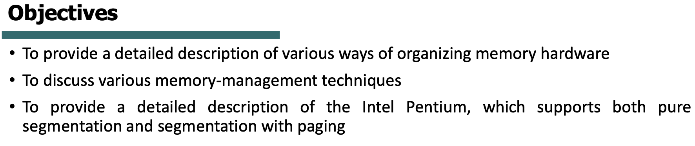

# Memory Management
- [Memory Management](#memory-management)
  - [Overview](#overview)
  - [Protection](#protection)
  - [Address Binding](#address-binding)
  - [MMU](#mmu)
    - [Esercizi](#esercizi)
  - [Fragmentation](#fragmentation)
  - [Paging](#paging)
    - [Esercizio](#esercizio)
    - [Page table](#page-table)
    - [Memory Protection](#memory-protection)
    - [Hierarchical Paging](#hierarchical-paging)
    - [Hashed Page Tables](#hashed-page-tables)
    - [Inverted Page Table](#inverted-page-table)
    - [Esercizio](#esercizio-1)
    - [Swapping](#swapping)

## Overview

Obiettivo: vogliamo avere tanti programmi in esecuzione in parallelo, e avere esecuzioni veloci.

Vogliamo avere un meccanismo di protezione: un processo non dovrebbe poter accedere alla memoria usata da un altro processo.

Quando scriviamo un programma, e lo eseguiamo, chiediamo al processore di eseguire il codice del programma.
Il codice del programma viene caricato in memoria principale, e la cpu per eseguire un’applicazione ha accesso diretto solo a memoria principale o registri.
Il file eseguibile del programma però si trova in disco, quindi il primo passo è **spostare questi dati/codice dal disco alla memoria principale**, così che la CPU vi abbia accesso diretto.

Primo problema: abbiamo “poco” spazio in memoria principale, e dobbiamo trovare un meccanismo per alternare le cose che carichiamo dal disco, che potenzialmente sono invece tante.

Non abbiamo solo un programma: vorremmo poter eseguire tanti programmi in parallelo, quindi diversi programmi che dobbiamo caricare in memoria principale.

Ogni processo caricato in RAM poi deve avere accesso solo ai suoi dati e istruzioni, e non dovrebbe poter manipolare zone di memorie riservate ad altri processi.

Se ad esempio vogliamo eseguire un programma che banalmente faccia ***C=A+B,*** non solo dobbiamo spostare in RAM l’istruzione, ma anche i dati necessari per eseguire il calcolo.

## Protection

Come attuiamo il meccanismo di protezione, per dire ad un processo qual è la sua zona di memoria principale in cui può operare e che non può andare altrove?
Abbiamo 2 “boundary registers”: ***base*** e ***limit registers,*** che definiscono l’indirizzo di base e limite in memoria principale che definiscono la zona di memoria riservata al processo.

La cpu deve controllare che l’indirizzo che sta cercando di usare sia compreso tra indirizzo ***base*** e ***base + limit,*** controllando appunto i registri ***base e limit***.

Questo controllo, e il caricamento dei registri base e limit viene fatto tramite un modulo hardware apposito, ed è quindi **molto veloce**.

## Address Binding

Quando creiamo un eseguibile, l’indirizzo di memoria definito per essere caricato in memoria nel **codice** è un indirizzo simbolico.
Ad esempio nel codice potremmo trovare che il programma deve essere caricato in 0000, ma ciò è un indirizzo simbolico: non è per niente detto che il programma verrà caricato lì.

Il compiler tipicamente ***binda*** gli indirizzi simbolici in indirizzi riallocabili.

Il binding tra istruzioni/dati e memoria può avvenire in una di queste tre fasi.

- Compile time: specifichiamo direttamente qual è l’indirizzo di memoria effettivo che vogliamo usare
- Load time: se l’indirizzo di memoria non è noto a compile time, il compiler deve generare del codice **riallocabile** in qualsiasi zona di memoria (consentita)
- Execution time: se il processo viene spostato tra RAM e disco durante la sua esecuzione da una zona di memoria ad un altro, il binding viene fatto durante l’esecuzione del programma (*Swapping?*)

Logical address = indirizzo simbolico, non è l’indirizzo **definitivo** di memoria in cui troveremo i dati/istruzioni del nostro processo (è un ***virtual address***).
Esso viene generato dalla CPU e convertito in indirizzo fisico tramite un meccanismo di mapping ***virtual address→physical address.***

Abbiamo dunque bisogno di *qualcosa in mezzo* tra CPU e RAM che faccia questo mapping.
Questa operazione può avvenire anche a ***runtime***.

Il modulo **Hardware** che si occupa di questa operazione è la ***MMU***.

## MMU

Generalizzando, il base register viene chiamato ***relocation register***.
Il suo valore viene sommato ad ogni indirizzo logico generato da un processo utente per definire l’**indirizzo fisico finale di memoria**.

Quando eseguiamo un programma, l’intero codice del programma deve essere caricato in memoria per eseguire.
Però routines ed eventuali funzioni di librerie vengono caricate quando ve n’è l’esigenza a runtime.

Se 2 processi usano una stessa libreria, non è necessario caricare la stessa libreria 2 volte, ma possiamo caricarla una volta sola e farla condividere dai processi.
Questo è possibile tramite le ***Dynamic Linked Libraries***, al contrario del meccanismo di ***Static Linking*** che prevede di combinare insieme codice del programma e delle librerie, rendendoli un tuttuno e quindi caricando tutto insieme (quindi per più processi che usano la stessa libreria, questa verrebbe “caricata” più volte).

Come gestiamo lo spazio in RAM?
Un’idea sarebbe che, appena arriva un processo da eseguire, lo carichiamo nel primo posto disponibile in RAM.
Poi ne arriva un altro, facciamo lo stesso e così via..

Quando un processo termina, si libera un “buco” in memoria, che eventualmente può essere occupato da un altro processo che deve essere eseguito.

Se non c’è spazio sufficiente per essere caricato, il processo viene messo in stallo e non può essere eseguito, anche se magari abbiamo 2 partizioni libere, separate da una zona di memoria occupata da un altro processo: se nessuna delle due partizioni è sufficiente per caricare il nuovo processo (ma magari la loro somma si), il processo **non può essere caricato**.

Per questo esistono diverse tecniche per gestire lo spazio in memoria in modi più efficienti.

Vediamo che quando il programma fa riferimento a un indirizzo di memoria, intanto vediamo se esso è < ***limit register***, se sì vi sommiamo il ***relocation register*** per trovare l’indirizzo fisico finale mappato.

Assumiamo che un grande processo venga caricato in memoria.
Quando termina lascerà un grande buco in memoria disponibile.
Se un processo piccolo viene caricato in tale buco, lascerà spazio in memoria inutilizzato.

Quindi in queste situazioni, in cui abbiamo buchi in memoria, bisogna scegliere una buona tecnica per decidere in quale “buco” caricare i nuovi processi che arrivano.

Tre possibilità: ***First-fit, Best-fit, Worst-fit.***

***First-fit***
Carichiamo nel primo buco abbastanza grande da accogliere il processo.
Quindi non c’è bisogno di “analizzare” l’intera memoria, ma appena troviamo un buco disponibile per il processo, lo usiamo.

***Best-fit***
Carichiamo il processo nel buco più piccolo disponibile per accogliere il processo.
Richiede l’analisi dell’intera memoria, a meno che la lista di spazi disponibili non sia ordinata per dimensione.

***Worst-fit***
Carichiamo il processo nel buco più grande disponibile.
Richiede l’analisi dell’intera memoria, a meno che la lista di spazi disponibili non sia ordinata per dimensione.
Perchè è utile questa tecnica?
Perchè lo spazio che rimane libero dopo aver caricato il nuovo processo speriamo sia abbastanza grande da poter accogliere altri processi, quando invece nel ***Best-fit*** magari lasciavamo pochissimo spazio libero, inutile per caricare un nuovo processo in quel poco spazio.

### Esercizi

**FIRST-FIT**

Con questo approccio siamo stati veloci, non dovendo cercare l’intera lista di spazi disponibili. C’era tra l’altro abbastanza spazio per ciascun processo, quindi nessun processo è rimasto in attesa di avere uno spazio disponibile.

**BEST-FIT**

Abbiamo allocato tutti i processi che sono arrivati, senza lasciarne nessuno in attesa.
Più lento rispetto a First-fit.

**WORST-FIT**

Con questo approccio P5 deve rimanere in attesa perchè non vi è uno spazio abbastanza grande da accoglierlo, anche se la somma dei singoli buchi sarebbe sufficiente, ma avendo usato una tecnica di **allocazione di indirizzi di memoria contigui**, non possiamo farci nulla.

## Fragmentation

Quando i processi terminano liberano la memoria lasciando quindi dello spazio libero utilizzabile da altri processi.
Questa situazione causa ***frammentazione***, che può essere di 2 tipi:

- **External Fragmentation**
Lo spazio totale per un nuovo processo esiste, ma lo spazio non è contiguo.
- **Internal Fragmentation**
Se decidiamo di partizionare la memoria in blocchi, potremmo ritrovarci nella situazione in cui un nuovo processo occupa una di tali partizioni, ma usa meno spazio dello spazio totale della partizione che occupa. Questo spazio inutilizzato **non** può essere usato da un altro processo.

Vediamo alcune soluzioni:

- **Compaction**
La CPU decide di non eseguire ciò che l’utente chiede di eseguire in quel momento, ma si prende qualche ciclo di clock per “compattare” lo spazio disponibile in memoria, dunque per spostare i processi che occupano la memoria “tutti insieme” vicini, lasciando un unico grande spazio disponibile in memoria.

Due problemi: i processi vengono spostati, ma i processi sanno qual è il loro spazio in memoria tramite base e limit registers, che quindi devono essere **aggiornati** quando i processi vengono spostati.
Altro problema: overhead, infatti la CPU è impegnata in queste operazioni piuttosto che eseguire i processi che deve eseguire.

## Paging

- **Paging**
Finora abbiamo usato una tecnica di indirizzamento **contiguo**, quindi se ad esempio un processo ha bisogno di 4KB di spazio, abbiamo bisogno di 4KB di spazio contiguo in memoria.
Vediamo ora una tecnica di indirizzamento **non contiguo**.
Dividiamo la memoria fisica in diversi blocchi di dimensione fissa, chiamati ***frames.***
D’altra parte dividiamo anche la ***logical memory*** in diversi blocchi di dimensione fissa, che chiamiamo ***pages***.
Invece di mappare tutta la memoria di cui ha bisogno un processo, possiamo mappare le pages di un processo ai frames in memoria fisica.
Quindi se ad esempio abbiamo un processo che ha bisogno in totale di 4KB, ma dividiamo il processo in 4 pages, possiamo allocare queste 4 pages in 4 frames diversi, anche non contigui.
Se prima però avevamo base e limit register, ora abbiamo bisogno di elementi più complessi per far capire al processo quali sono le zone di memorie a lui riservate.
La MMU diventa quindi più complessa, avendo da un lato ***pages*** e dall’altro lato ***frames***.
La dimensione di una ***page*** e di un ***frame è uguale**.*

In questa situazione, quando facciamo riferimento a un’istruzione o un dato, dobbiamo ora capire in che pagina si trova, e all’interno di tale pagina quanto dobbiamo spostarci per trovare ciò che ci interessa (offset).

La page table memorizza il mapping tra page e frame in cui è effettivamente memorizzata la porzione di istruzioni/dati della page a cui vogliamo accedere.

Vediamo che il corrispettivo dell’offset della page, l’offset del frame in memoria fisica, è **uguale**, dato che abbiamo detto che la dimensione di page = dimensione di frame.
Dunque l’offset per trovare l’istruzione/dato in memoria fisica è uguale.

Abbiamo risolto l’External Fragmentation, ma possiamo avere ancora ***Internal Fragmentation***, in quanto vediamo dalla slide che il processo in esempio viene diviso in 35 pagine da 2048B, ma rimane ancora 1086B da “mappare”.
Dunque questa quantità viene allocata in un frame, che però non verrà utilizzato completamente (1086/2048).

Una soluzione sarebbe ridurre la dimensione di pages/frames.
Il problema è che ogni processo ha la sua page table, e se riduciamo la dimensione di pages la dimensione della page table aumenterà (abbiamo più pages → più frames → più entries nella tabella per fare il mapping tra pages e frames).

### Esercizio

***Logical address***: 64 pagine da 1024 di size → 6 bit per indirizzare le pagine e 10 bit per l’offset.
***Physical address***: 32 frames, sempre da 1024 di size → 5 bit per indirizzare i frames e 10 bit per l’offset.

6bit+10bit = 16 bit (logical address)

5bit+10bit = 15 bit (physical address)

Divido 3085 per 1024 per vedere fino a dove arriviamo.
3085/1024 = 3 con resto di 13 (1024*3 = 3072).
Quindi troviamo in page 3 con offset 13.

E così via per gli altri indirizzi logici chiesti..

Frammentazione: non ci piace perchè abbiamo spazio non contiguo inutilizzabile.
Allora siamo passati ad una tecnica di spazio non contiguo, dividendo la memoria in blocchi di dimensioni fissa (pages per mem virtuale, frames per mem fisica).
Ora bisogna mappare le pages ai frames in memoria fisica.
Quindi la MMU ora implementa una page table, che si occupa di memorizzare il mapping tra page e frame.

### Page table

Vengono usati due registri per dire al processo dove trovare la sua page table in memoria.
Il PTBR memorizza il puntatore alla page table del processo in memoria fisica, il PTLR indica la dimensione della page table.

Andiamo avanti: in questa situazione quindi ogni accesso a istruzione/dato richiede 2 accessi a memoria, uno per leggere la page table e uno per leggere l’istruzione/dato.
Quindi siamo più lenti..

Troviamo un’altra soluzione: usare un’altra tabella, implementata tramite hardware, chiamata ***TLB***, che è una memoria molto veloce e risolve il problema della lentezza, perchè è talmente veloce che l’accesso alla page table non viene considerato un accesso in memoria se usiamo una TLB. La TLB memorizza, come la page table, le corrispondenze page number-frame number.

La TLB è una cache molto veloce, quindi molto costosa e quindi molto piccola.
Non può ovviamente contenere il mapping per tutti i processi in esecuzione, quindi quando dobbiamo tradurre un indirizzo, per prima cosa controlliamo la TLB, se troviamo la corrispondenza allora bene, altrimenti abbiamo un ***TLB miss*** e quindi dobbiamo fare un accesso alla memoria per andare a leggere la page table del processo in RAM.

Poichè la TLB può contenere entries relative a processi diversi, e ovviamente questi potrebbero usare gli stessi page numbers, c’è bisogno di capire se l’entry che eventualmente troviamo in TLB corrisponde effettivamente al nostro processo.
Per questo alcune TLB implementano gli ***ASIDs***, identificatori dello spazio d’indirizzamento dei processi, associati ad ogni entry della TLB.
In alternativa dovremmo flushare la TLB ad ogni context switch.

### Memory Protection

Su page table è memorizzato il mapping page-frame, e possiamo anche avere informazioni aggiuntive in ogni entry.
Ad esempio ***protection bit***, con cui identifichiamo se può essere usata per essere letta, scritta o eseguita.

Es. Se protection bit = R, allora la page è read-only

*Come funziona il protection bit?*
Lo vedremo più in là con la trattazione su virtual memory.

***Valid bit***: quando un processo cerca di avere accesso ad una pagina, con questo bit controlliamo se è valida oppure no per il processo stesso. In particolare viene usato quando dobbiamo *swappare* pagine di uno stesso processo tra RAM e disco, magari bisogna fare spazio in memoria quindi una pagina nella page table diventa non più valida perchè è stata sostituita da un’altra pagina (di un altro processo).
Ricorda che ogni processo ha la propria page table.

Es quando includiamo <stdlib.h>.
***Reentrant code:*** nessun processo può modificarlo, ma solo leggere o eseguire tale codice.

Più processi possono condividere e usare contemporaneamente tale codice *reentrant*, che appunto non può mai essere modificato durante l’esecuzione.

L’indirizzo del frame in cui viene caricato il reentrant code viene mappato su ciascuna page table dei processi che condividono la libreria.

La page table vista finora, che appunto è memorizzata anch’essa in RAM, ha ancora bisogno di memoria contigua per essere caricata.
Sennò avremmo bisogno di un meccanismo esattamente come la page table che ci dica dove si trovano i frames in cui troviamo la page table.. insomma!

Le page tables dei processi possono prendere “tanto” spazio, come si vede dalla slide.

Vediamo dunque alcuni modi più efficienti (dal punto di vista dello spazio occupato in memoria) di implementare una page table:

- **Hierarchical Paging**
- **Hashed Page Tables**
- **Inverted Page Tables**

### Hierarchical Paging

Non abbiamo una singola page table che fa riferimento a memoria fisica, ma abbiamo diversi livelli di page table.
In pratica andiamo a dividere la page table stessa in pagine, e quindi avremo un’ulteriore page table “esterna” che mappa pagine (della page table “interna”) con i frames in cui si trovano.

Se usiamo un meccanismo del genere, l’operazione di MMU che facevamo prima per trovare i dati della pagina non è più funzionante: a questo punto dobbiamo “attraversare” un ulteriore livello di paging.

L’offset rimane sempre come prima perchè è sempre di quanto ci dobbiamo spostare nella pagina (di livello 2) in cui andiamo a trovare effettivamente i dati.
La parte restante la dividiamo in 2: pagina di livello 1, e pagina di livello 2.
La prima parte dell’indirizzo logico rappresenta, ad esempio con 10 bit, il primo livello di gerarchia: cioè tramite questi bit andiamo a trovare nella page table, con 2^10 entries, il ***page number*** della page table di livello 2, che contiene a sua volta un mapping page-frame.

Il vantaggio è che, anche se entrambe hanno bisogno di spazio contiguo per essere allocate, ciascuna ne necessita “di meno”, perchè se dovessimo allocare una singola page table da 32 bit avremmo bisogno di molto spazio (come dicevamo nella slide di prima).
Quindi dividiamo in 2 cosicchè ciascuna necessiti di meno spazio contiguo.

Con 2 livelli di page tables miglioriamo l’occupazione in memoria della page table però, se abbiamo TLB miss abbiamo peggiorato le performances perchè dobbiamo fare 3 accessi alla memoria invece di 1.

Se un processo non ha bisogno di tanto spazio per la sua page table, in uno scenario del genere possiamo pensare che le sue pagine siano mappate direttamente nella page table di livello 2, senza passare dalla page table di livello 1.
Come possiamo indicare una cosa del genere alla CPU?
Potremmo riservare ad esempio il primo “indirizzo” di page table di livello 1 (tipo 0x00000000), e a quel page number iniziale della page table di livello 1 troviamo le page tables dei processi che hanno bisogno di poco spazio.

### Hashed Page Tables

Il page number è l’input della funzione di hash, tramite cui vorremmo mappare la page al frame.
In questa tecnica, ogni entry della hash table è una linked list di mapping page-frame in cui ogni page number genera lo stesso hash.
È come se stessimo memorizzando in una singola entry più di un mapping.
Dunque il page number dell’indirizzo logico è l’input della funzione hash, che è implementata tramite un certo hardware, e in questo caso genera 3 dati in output: page number, frame number, e un puntatore all’elemento successivo.
Si scorre quindi la lista (grazie ai puntatori) fino a trovare il match con il page number che stiamo esaminando, per trovare quindi il corrispondente frame number.

### Inverted Page Table

Finora abbiamo visto che ogni processo ha una sua page table.
Inverted Page Table funziona al contrario: non iniziamo dalla pagina, ma dal frame!
Quindi memorizziamo il mapping frame-page, e vediamo ciascun frame quale pagina ha allocato.
Quindi a sto giro la “page table” è in **condivisione tra tutti i processi** (perchè la memoria fisica è una, e noi mappiamo i frame fisici con le pagine che allocano, che possono essere di qualsiasi processo).
Il vantaggio è che abbiamo una sola page table, quindi non una per processo → meno spazio occupato.

Ora però, essendo unica la page table e accessibile da tutti i processi, dobbiamo aggiungere informazioni per capire a quale processo appartiene una certa pagina allocata in un frame.
Possiamo usare il PID, che aggiungiamo alle informazioni da memorizzare nella page table.

Il problema è che dobbiamo fare una ricerca nella page table, e quindi possibilmente abbiamo tanti accessi a memoria → performance peggiori.

### Esercizio

### Swapping

Può capitare che durante l’esecuzione di un processo, alcune pagine allocate per quel processo debbano essere sostituite, in memoria, da pagine appartenenti ad altri processi (perchè c’è bisogno di spazio).
Quindi tali pagine che vengono sostituite vengono riportate su disco finchè poi non sono nuovamente necessarie e vengono riportate in RAM.

---