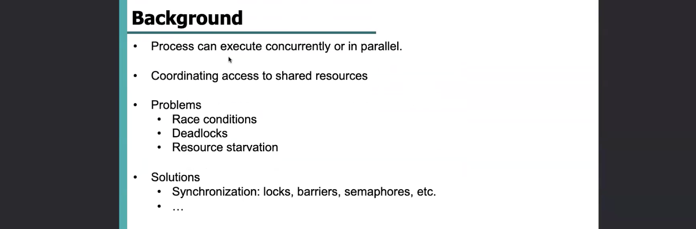

# Lab 3 — Synchronization

- [Lab 3 — Synchronization](#lab-3--synchronization)
- [Semafori](#semafori)
  - [P (wait)](#p-wait)
  - [V (signal)](#v-signal)
- [Locks](#locks)
  - [lock\_create](#lock_create)
  - [lock\_acquire](#lock_acquire)
  - [lock\_release](#lock_release)
- [Condition variable](#condition-variable)
  - [OLD](#old)

**Race Condition:** quando siamo in una situazione di concorrenza o accesso a dati e risorse condivisi, ci troviamo di fronte ad un problema di tipo Race Condition — cioè il risultato finale potrebbe dipendere dall’ordine con cui i vari task sono eseguiti.
Noi vorremmo che il risultato non dipendesse dall’ordine con cui eseguiamo i task.

**Deadlocks:** A è in attesa che B finisca, il quale è in attesa che C finisca, il quale è in attesa che A finisca. Attesa circolare.

**Resource Starvation:** alcuni task non riescono ad ottenere le risorse necessarie per continuare l’esecuzione, perchè occupate indefinitivamente da altri processi.

La soluzione implementata tramite Mutex Locks comporta un’attesa di tipo ***busy waiting***, perchè un thread che cerca di acquisire il lock per entrare in sezione critica continua a chiamare acquire() finchè non riesce ad acquisire il lock. 
Il vantaggio è che, però, se il lock è acquisito da un altro thread per un breve periodo, il thread che continua a chiamare acquire() in esecuzione su un altro core, potrà entrare presto in sezione critica senza alcun bisogno di context switch.

Differenza tra busy waiting e non-busy waiting: 

- busy waiting: chiedo in continuazione se il lock è occupato, e quando si libera lo acquisisco
- non-busy waiting: chiedo se il lock è occupato — se lo è, vado a “dormire” sapendo che verrò svegliato da qualcun altro quando il lock sarà libero, in modo da poterlo acquisire

Per implementare entrambi i tipi di attesa, abbiamo bisogno di supporto per le operazioni **atomiche**.

Noi vedremo in particolare il meccanismo di ***Hardware instructions***, ma vediamo brevemente anche le altre.

**Memory barriers**
Le letture e scritture in memoria devono essere consistenti: se un processore scrive una cella di memoria, un altro processore non può leggere tale cella di memoria finchè il primo processore non ha finito la scrittura.

L’implementazione di un Mutex Lock fondamentalmente prevede il seguente comportamento: *finchè il lock non è disponibile faccio busy waiting. Non appena diventa disponibile, lo acquisisco settandolo nuovamente “non disponibile” (così che altri threads non possano entrare in sezione critica) ed entro in sezione critica. Una volta finito, faccio la release(): rendo cioè disponibile il lock agli altri threads.*

Il problema sta nell’acquire(): supponiamo che 2 processi, che contemporaneamente sono in busy waiting, ad un certo punto leggono che il lock è disponibile (available == true). Entrambi quindi entrano in sezione critica e settano available = false, ciascuno pensando di essere il proprietario del lock.
Questo è un problema.
La soluzione consiste nel fare in modo che **non ci sia alcun tempo tra il momento in cui leggo available == true e setto available = false.**
Abbiamo cioè bisogno di un’operazione **atomica**: test_and_set().

lock == 0 → available
lock == 1 → not available

Finchè test_and_set(&lock) ritorna *true* (dunque lock non available) → busy waiting.
Non appena torna *false*, lo ri-setta a *true* atomicamente, ma consentendo al thread di entrare in sezione critica, mentre tutti gli altri leggeranno true (lock non disponibile).
Questa operazione atomica di test and set può essere svolta solo da un thread alla volta, poichè atomica, quindi non c’è possibilità che 2 threads entrino in sezione critica contemporaneamente.

Simile al comportamento di test_and_set(), ma invece di basarsi su un boolean (true/false), si basa su una coppia di variabili.

Il semaforo può essere visto come **una estensione di un lock**, nel senso che un semaforo binario è essenzialmente come un lock.
Il semaforo però non è usato solo come meccanismo di mutua esclusione, ma anche come meccanismo di sincronizzazione tra due processi.

Come possiamo implementare un’attesa di tipo *non-busy waiting*?
Su un sistema single core ciò può essere fatto disabilitando gli interrupts, sapendo che solo un thread alla volta è in esecuzione sul processore. 
Quindi quando il thread entra in sezione critica, disabilitiamo gli interrupts, in modo tale che altri thread non possano interrompere l’esecuzione per venire schedulati e possibilmente entrare anch’essi in sezione critica.

Su un sistema multi core questa strategia non funziona.
In questo contesto abbiamo bisogno di primitive di sincronizzazione.

Modo di implementare un semaforo senza busy waiting.
Decremento il valore del semaforo: se dopo aver decrementato vedo che il valore è minore di zero, allora devo aspettare → block().
Qualcun altro mi sveglierà quando il valore sarà stato incrementato → wakeup(P).

In OS161 troviamo già implementati gli spinlocks, e dobbiamo implementare i locks.

In OS161, in **`kern/thread/thread.c`** , troviamo già le implementazioni a basso livello delle primitive di wait e signal:

- wchan_create
- wchan_destroy
- wchan_sleep
- wchan_wakeone
- wchan_wakeall

Le prime due creano e distruggono una certa struttura dati chiamata ***wait channel***.
wchan_sleep → wait
wchan_wakeone → signal 1 sleeping process
wchan_wakeall → signal all sleeping process

Il file **`kern/thread/synch.c`** contiene le funzioni per la gestione dei semafori, locks e condition variables.

# Semafori

I semafori sono già completamente implementati.
In **`kern/include/synch.h`** troviamo la definizione della struttura di un semaforo:

Diamo un’occhiata al funzionamento dei semafori (synch.c).

`sem_create` riceve come parametri il **nome** del semaforo, e il **counter** a cui deve essere inizializzato.
Vediamo che la funzione alloca una struttura di tipo semaphore, vi assegna il nome passato come parametro e vi assegna un wait channel, una struttura dati che viene allocata tramite `wchan_create`.
Inoltre inizializza lo spinlock del semaforo.
Notiamo, che al contrario del wait channel, lo spinlock (nella definizione della struttura del semaforo) non è un puntatore, quindi non necessita di essere allocato, cosa che invece succede per il wait channel.
Viene anche inizializzato il counter del semaforo tramite il parametro passato alla funzione.

`sem_destroy` fa una cleanup dello spinlock (un paio di KASSERT per assicurarsi che nessuno stia usando lo spinlock?), dealloca il wait channel del semaforo, e poi dealloca il semaforo stesso.

## P (wait)

Vediamo la funzione di wait.
Essa riceve il puntatore al semaforo.
Proviamo ad acquisire uno spinlock sul semaforo stesso, per assicurarci mutua esclusione sul **counter** del semaforo.
Una volta acquisito, controlliamo il counter del semaforo: finchè il counter è uguale a 0, dobbiamo aspettare.
Andiamo in stato di sleep nel wait channel del semaforo in questione, ovviamente (sem→sem_wchan).
Ma se andiamo in sleep, perchè appunto dobbiamo aspettare, dovremmo anche rilasciare lo spinlock acquisito (altrimenti il thread va in sleep senza rilasciare il lock, e gli altri thread non potrebbero acquisirlo).
Questo viene effettivamente fatto dalla wchan_sleep, che appunto vediamo che riceve come parametro anche il lock del semaforo, per rilasciarlo e provare a riacquisirlo al ritorno dallo stato di sleeping.

Più precisamente il rilascio dello spinlock viene fatto all’interno di `thread_switch` , che fa anche tante altre cose, ma per ora non scendiamo nei dettagli.
Inoltre in `wchan_sleep` ci assicuriamo che siamo effettivamente possessori del lock, e che non possediamo altri locks (sennò vorrebbe dire che andiamo in stato di sleep mentre possediamo dei locks → deadlock per altri threads).

Ad ogni modo, una volta che il thread è in stato di sleeping, esso può essere svegliato in seguito ad una signal sul wait channel.
Può essere, però, che nel frattempo il counter del semaforo diventi di nuovo 0, e per questo abbiamo il while che va a ritestare la condizione: se è di nuovo 0, tornerò in stato di sleeping, altrimenti uscirò dal while.
Vediamo anche da qui come abbia senso che il lock sul semaforo venga riacquisito al ritorno dallo sleep (nella `wchan_sleep`): come prima di entrare nel while, dobbiamo avere il lock per la mutua esclusione su sem→sem_count == 0.
Questo verrà poi mantenuto, nel caso in cui si possa procedere nell’esecuzione (per poi essere rilasciato una volta decrementato il counter), o rilasciato nuovamente nella `thread_switch` se dobbiamo tornare in stato di sleeping.

## V (signal)

Molto più semplicemente, la funzione di signal acquisisce il lock sul semaforo, incrementa il counter (assicurandosi poi che esso sia maggiore di 0) e fa una `wchan_wakeone` sul wait channel del semaforo, e rilascia il lock.

Anche in questo caso passiamo il lock sul semaforo a `wchan_wakeone` , perchè questa è un’operazione che possiamo fare solo se siamo in possesso dello spinlock.

# Locks

In modo simile ai semafori, lock_create alloca spazio per una struttura di tipo lock, e le assegna il nome passato come parametro.
Vediamo che il resto è da implementare..
Due possibilità: implementiamo un wait channel e un flag (0/1) come “counter” similarmente a com’è stato fatto per un semaforo in `sem_create` , oppure potremmo creare un semaforo (che appunto è già implementato) con counter a 1 (quindi un semaforo binario) e sfruttare l’implementazione dei semafori per implementare i locks!
Nella seguente trattazione consideriamo l’ultimo caso.

Vediamo quindi la soluzione del prof:

Vediamo che, se abbiamo impostato `USE_SEMAPHORE_FOR_LOCK` a 1, la definizione della struttura di un lock ora include un puntatore ad un semaforo.
Inoltre, troviamo uno spinlock e una novità: un puntatore al thread che possiede il lock.
Infatti, il lock introduce il concetto di possesso: solo il thread che possiede il lock può fare la signal, mentre nei semafori chiunque poteva fare signal (qualunque dei threads entrati in sezione critica nel caso di semaforo non binario).
Il puntatore al thread owner del lock è dichiarato volatile per garantire che sia condiviso, quindi sia presente in memoria e non in un registro della CPU.

## lock_create

Nella creazione del lock notiamo la creazione di un semaforo binario, con il nome del lock stesso, e poi l’inizializzazione dell’owner del lock (NULL, visto che ancora nessuno lo possiede) e dello spinlock.

## lock_acquire

*Come possiamo acquisire il lock?*
Sfruttando la funzione **`P`** del semaforo!
Non è altro che la funzione che abbiamo visto prima: manderà il thread in sleep finchè il lock non è disponibile, se lo è invece lo rende non disponibile per tutti gli altri e consente di proseguire nell’esecuzione.
In particolare, dopo aver acquisito il lock, impostiamo subito il thread corrente come owner del lock.
Lo `spinlock_acquire(&lock→lk_lock)` , anche se è appurato che siamo proprietari del lock e in teoria gli altri threads non dovrebbero star facendo nulla con il lock, va messo per sicurezza, dato che comunque stiamo modificando l’owner del lock.

## lock_release

Nella funzione `lock_release` semplicemente impostiamo a NULL l’owner del lock e chiamiamo la funzione `V` (signal).
Impostiamo l’owner a NULL perchè questa condizione viene usata dai threads per capire se il lock è disponibile o meno (lk_owner ≠ NULL → lock non disponibile → wait).

Notiamo inoltre che la funzione `lock_do_i_hold` è stata modificata adhoc per il lock: abbiamo detto che siamo possessori del lock se il thread corrente è effettivamente quello memorizzato come owner nella struttura del lock.
Quindi è stato introdotto questo controllo.

# Condition variable

Con le ***condition variable*** aspettiamo l’avverarsi di una condizione. 
Tale condizione si basa su alcune variabili.
Nell’esempio, se `x == 0 && (y>0 || z>0)` allora wait.

D’altro canto un altro thread starà lavorando su tali variabili, e, se alla fine del calcolo, la condizione di wait è soddisfatta, allora si fa una signal. 

Abbiamo visto come le primitive di wchan_sleep, wchan_wakeone e wchan_wakeall siano essenzialmente le primitive che implementano le funzionalità di wait e signal.
Tali funzioni prendono come parametro anche uno spinlock, che appunto viene rilasciato quando il thread va in sleep e riacquisito al suo ritorno.

Le condition variable hanno delle primitive assolutamente analoghe, ma che ricevono come parametro un lock piuttosto che uno spinlock:

Alla fine l’unica differenza tra wait channel e condition variable è che: nel caso di wait channel la condizione che deve essere osservata viene osservata tramite spinlocks, e nel caso di condition variable tramite locks. 

---

## OLD

OS161 ha già 2 primitive di sincronizzazione implementate: i semafori e gli spinlocks.
Ne esistono altre e l’obiettivo del lab è implementare queste altre.

Lo Spinlock è una primitiva che consente la mutua esclusione: il processo che richiede accesso alla sua sezione critica, se nessuno sta usando la sezione critica, può accedervi. 
Quando arriva un secondo processo che vuole accedervi, questo deve chiedere se è disponibile lo spinlock, cioè questa variabile che viene data al thread che può accedere alla sezione critica e ha delle caratteristiche importanti:

- Lo spinlock può essere rilasciato solo dal thread che l’ha acquisito
- Gli altri thread che non possono acquisire lo spinlock looppano continuamente in una condizione di test-and-set finchè lo spinlock non sarà nuovamente disponibile: cioè il thread continua a fare questo loop inattivo occupando cicli di cpu finchè lo spinlock non sarà libero.

Questa soluzione di continuare a far attendere il thread, occupando anche cicli cpu, non è ottimale per le grandi sezioni critiche perchè se mi aspetto che la sezione critica sia disponibile a breve allora okay, ci sta che non metto in pausa il thread ed evito tutto l’overhead che ne deriverebbe (tanto dopo poco prenderà lo spinlock), ma se la sezione critica richiede tanto tempo per essere eseguita e quindi non ho un cambio di spinlock rapido, continuare ad occupare cicli di cpu inutilmente — non è ottimale.
Infatti per le sezioni critiche più grandi si utilizza il Lock, un’altra variabile che vedremo dopo e che dovremo implementare, che mette in sleep il thread che non può ancora accedere alla sezione critica.

I semafori proteggono anch’essi l’accesso alla sezione critica, ma in modo diverso: può esserci mutua esclusione ma non per forza (in lock e spinlock solo un thread può entrare in sezione critica), mentre i semafori hanno una variabile interna detta counter, che in generale quando è maggiore di 0, i threads possono entrare in sezione critica e quando entrano decrementano il counter, finchè questo non sarà 0 e quindi i threads non potranno entrare.
Il counter viene incrementato quando un thread esce dalla sezione critica.

Il counter dei semafori è inizializzato alla creazione del semaforo, e in base al valore iniziale del counter possiamo eseguire mutua esclusione (es. di semaforo binario: se ho un counter inizializzato a 1, ciò vuol dire che solo un thread alla volta può entrare).

*Qual è allora la differenza principale tra un semaforo binario e un lock o spinlock?*
Gli ultimi due hanno il concetto di proprietà: il lock può essere rilasciato solo dal thread che l’ha acquisito, mentre il semaforo non ha questa limitazione.

L’ultima variabile di sincronizzazione che vediamo oggi (anch’essa da implementare, insieme ai Locks) sono le ***Condition Variables***.
Sono anch’esse primitive di sincronizzazione per eseguire l’accesso alle sezioni critiche con un grado di libertà in più perchè consente l’accesso alla sezione critica in base ad una condizione: se la condizione è soddisfatta (if x == true) allora entro nella sezione.

A differenza degli altri metodi dove non è possibile eseguire un check su una condizione.