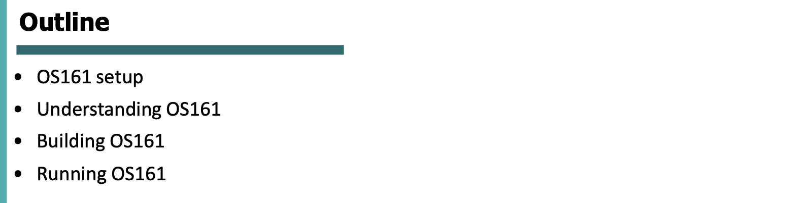

# Introduction to OS161

- [Introduction to OS161](#introduction-to-os161)
  - [Overview](#overview)
  - [Building a kernel](#building-a-kernel)
- [Threads](#threads)
  - [Process](#process)
  - [Thread Structure](#thread-structure)
  - [Thread Library](#thread-library)
  - [Thread Structure](#thread-structure-1)
  - [Thread\_fork](#thread_fork)
  - [User Process](#user-process)
  - [Process structure](#process-structure)
  - [System Calls](#system-calls)
  - [sys\_\_exit](#sys__exit)
  - [thread\_exit](#thread_exit)
  - [thread\_switch](#thread_switch)
  - [exorcise](#exorcise)
  - [thread\_destroy](#thread_destroy)

## Overview

Os161 è un OS didattico, quindi le funzionalità di base sono implementate, mentre altre funzionalità no.

## Building a kernel

***conf*** lo usiamo per configurare il nuovo kernel, e ***compile*** per compilare il nuovo kernel.
***root*** poi per buildare il tutto.

---

# Threads

Ogni processo o thread rappresenta uno stato d’esecuzione di un programma d’esecuzione, e dispone di una certa quantità di memoria allocata, insieme ad un insieme di registri.

Possiamo suddividere la memoria dedicata ad un processo o thread in 3 categorie: program code, program data, e program stack.

Limitazione sul numero di thread che possiamo creare a livello kernel, ma noi non vorremmo limitarci (a livello utente) nella creazione di threads.
Ma dovendo avere un mapping 1 thread utente → 1 thread kernel le performance possono essere basse.

## Process

**Come viene dedicata e suddivisa la memoria di un processo o thread**

Questo per quanto riguarda un singolo processo..

Ma se abbiamo processi multithread, come viene gestita la memoria?

Vediamo che una parte (code, data e files) è condivisa tra tutti i threads, ma poi ogni thread ha il proprio stack, PC e registri..

Suddivisione di memoria di un singolo thread in esecuzione, per memorizzare il **contesto** di tale thread.

La struttura dati usata per memorizzare il contesto di un thread si chiama ***Thread Control Block***.
Questa struttura dati viene usata per memorizzare il contesto di un thread, specialmente utile quando bisogna fare ***context switching***.

## Thread Structure

La struttura di un thread, in OS161, memorizza le informazioni dei thread che vengono eseguiti.
In particolare vi troviamo:

- Nome del thread
- Nome del wait channel, se il thread è in stato di sleep
- Stato del thread (running, sleeping, ready, zombie)
- Puntatore allo stack livello kernel (ogni thread ha uno stack in memoria user e uno stack a livello kernel)
- Puntatore allo switchframe del thread (ossia il contesto: il valore dei registri in un dato momento dell’esecuzione del thread)
- Puntatore alla CPU su cui il thread viene eseguito
- Puntatore al processo cui appartiene il thread

Il Thread conosce il processo a cui appartiene, ma non viceversa!
Quindi un processo **non può** terminare un suo thread.
Questa è una peculiarità di OS161.. Potremmo implementare questa funzionalità in più.

## Thread Library

Lista di funzioni implementate in Os161 per gestire le operazioni di creazione di thread, context switch, terminare un thread etc..

## Thread Structure

**Kernel level stack e switch frame**: vengono usati per memorizzare il contesto di un thread.
Come detto prima, in generale un thread dispone di uno stack a livello utente e uno stack a livello kernel (vale a dire, uno nella memoria dedicata allo spazio d’indirizzamento utente, e uno nella memoria dedicata al kernel).
Questo perchè, ad esempio nel caso di una system call da parte di un thread utente (es. un’applicazione utente), il kernel deve avere uno stack isolato dalla memoria a livello user che non è sicura per eseguire il codice privilegiato.
D’altro canto, quindi, un kernel thread (cioè un thread di sistema che esegue di per sè delle operazioni privilegiate) usa soltanto lo stack a livello kernel, non essendo appunto un’applicazione utente. 

Quando facciamo switch di threads, dobbiamo memorizzare da qualche parte le informazioni del thread che viene messo in pausa.

Funzioni per creare, terminare e switchare (rispettivamente) un thread.

## Thread_fork

**Funzione per creare un thread**

Quando creiamo un nuovo thread dobbiamo dedicare parte della memoria per il nuovo thread.
La funzione thread_fork crea un nuovo thread, prendendo come parametri: 

- **nome** del nuovo thread
- **puntatore al processo** cui deve appartenere (in caso fosse Null, automaticamente verrebbe assegnato al processo del chiamante di thread_fork)
- **l’entrypoint** (cioè puntatore alla funzione che il nuovo thread deve iniziare ad eseguire)
- **i 2 parametri** dell’entrypoint (un puntatore e un number)

Vediamo che per prima cosa la `thread_fork` chiama `thread_create` , una funzione che di fatto alloca in memoria una struttura di tipo thread, assegnandogli il nome passato come parametro, il wait channel name “NEW” e lo stato di “Ready”.
Gli altri campi della struttura sono inizialmente assegnati a Null.
Adesso però, disponiamo di una struttura dati per il nostro thread.

In seguito, la `thread_fork` alloca spazio per lo stack del thread, richiamando `kmalloc` con parametro `STACK_SIZE` , una costante globale che di default vale 4096 (4KB).
Se dopo di ciò `newthread->t_stack == NULL` , allora la kmalloc non è andata a buon fine (spazio insufficiente per soddisfare la richiesta), dunque si procede a distruggere il nuovo thread creato tramite `thread_destroy` .
Se invece tutto va a buon fine, vediamo che `thread_fork` procede a “popolare” i campi della struct del nuovo thread, tramite i campi del thread chiamante, assegnandogli la cpu su cui eseguire, il nome del processo cui deve appartenere.
Inoltre, chiama `proc_addthread` che aggiorna il numero di threads appartenenti al processo, incrementandolo di 1.

Un’altra operazione importante che viene fatta, è inizializzare lo switchframe del nuovo thread tramite chiamata a `switchframe_init` che prende come parametri la struttura del nuovo thread, l’entrypoint e i parametri dell’entrypoint.

Senza scendere nei dettagli del funzionamento, essenzialmente questa funzione inizializza il contesto del nuovo thread: vale a dire che memorizza in appositi campi (sf_s0 etc..) i valori che dovranno essere caricati nei registri MIPS quando il thread verrà schedulato per la prima volta.
In particolare, lo switchframe viene inizializzato memorizzando l’entrypoint del nuovo thread, coi relativi parametri, e il riferimento a `mips_threadstart` , una routine in assembly che va effettivamente a caricare i registri coi valori appena detti e fa un jump a `thread_startup` , che avvierà poi di fatto l’esecuzione del thread.
Tutto ciò avviene ovviamente quando, in un secondo momento, il thread viene schedulato per l’esecuzione.

In fine, vediamo una chiamata a `thread_make_runnable` : senza scendere nei dettagli, essenzialmente imposta (di nuovo?) lo stato del nuovo thread a “Ready”, e lo aggiunge alla coda di run della cpu su cui deve eseguire.

**Terminare un thread**

**Mettere in pausa un thread**

Metto in coda di ready il thread e dò la possibilità di usare la CPU ad un altro thread.
Viene usata dallo stesso thread che deve mettersi in pausa.

Thread_fork è un wrapper delle funzioni thread_create, switchframe_init e thread_make_runnable.

thread_create alloca memoria per un nuovo thread e crea il TCB necessario per gestire il thread.

Abbiamo detto che un thread ha bisogno di una parte della memoria a lui dedicata per memorizzare informazioni dello stato dei registri, quando dobbiamo fare un context switch.
L’inizializzazione di questa parte di memoria viene fatta tramite ***switchframe_init***

Quando un thread è pronto (ha fatto thread_create e switchframe_init) mette il suo status a ready per dire alla CPU che è pronto per essere eseguito, appena ve n’è la possibilità.

Quando bisogna fare un thread switch usiamo la funzione ***Thread_switch***.
Prima di tutto si cambia lo stato del thread corrente *running → ready*.
Poi dobbiamo memorizzare lo stato del thread che sta andando in pausa e “caricare” sulla cpu il contesto del thread schedulato, questo viene fatto in particolare dalla funzione ***switchframe_switch***.

Anche se tutte le funzioni che gestiscono threads sono scritte in C, le funzioni che gestiscono il contesto sono scritte in **assembly**, quindi bisogna conoscere l’architettura su cui l’OS viene eseguito per fare queste operazioni.

*Queste due slides non servono per l’esame.*

## User Process

Immaginiamo che come utente scriviamo un’applicazione.
Eseguiamo il codice e creiamo quindi un nuovo processo.
Questo nuovo processo (applicazione) ha bisogno di memoria per la parte di codice, data, stack etc..

Vediamo quindi che in memoria abbiamo il kernel con la sua zona in cui memorizza data, code, etc.. ma anche un processo utente ha bisogno di zone di memoria in cui memorizzare le sue informazioni.

Il SO deve gestire la creazione di un nuovo processo: cioè dedicare della memoria a questo processo.
Tutto ciò che vedremo ora riguarda la creazione di un processo utente.

## Process structure

Quando un utente chiede di eseguire un’applicazione, chiede quindi di creare un nuovo processo.
A livello di SO, quando viene creato un processo, il SO deve creare una struttura dati in memoria per memorizzare delle informazioni.

Se vogliamo vedere in OS161, in proc.h vediamo una *data structure* che viene usata per memorizzare informazioni per un processo.

Ricordiamo che un thread sa a quale processo appartiene, ma un processo **non sa** quali siano i threads che gli appartengono.

Vediamo quindi che nella struttura dati di un thread viene memorizzato il riferimento al processo cui appartiene.

Ogni thread ha 2 stack:

- User level stack
Usato per eseguire *unprivileged application code*
- Kernel level stack
Usato per eseguire *privileged kernel code*

*proc_create_runprogram* viene usato per creare un processo utente.
Quando eseguiamo un’applicazione creiamo un processo e abbiamo bisogno di almeno 1 thread per eseguire tale processo.
Quindi la prima cosa che viene fatta, dopo aver creato il processo tramite *proc_create_runprogram*, è una chiamata a *thread_fork* per la creazione di tale thread.
Poi dobbiamo eseguire il processo e quindi si fa una chiamata a *run_program*

Vediamo nel dettaglio:

Quando eseguiamo un programma utente, ad esempio tramite comando `p testbin/palin` , viene chiamata la funzione `cmd_prog` , la quale a sua volta chiama `common_prog` , passandole fondamentalmente il nome del programma da eseguire.

La funzione `common_prog`  si occupa di chiamare `proc_create_runprogram` , la quale a sua volta chiamando `proc_create` e facendo altre operazioni, di base crea la struttura dati per il nuovo processo da eseguire.

Come abbiamo detto prima, poi, un processo ha bisogno di almeno un thread per eseguire, e quindi la funzione `common_prog` prosegue chiamando `thread_fork` , passandole il nome del processo (che quindi sarà anche il nome del thread), puntatore alla struttura del processo appena creata, e la funzione `cmd_progthread` come entrypoint..
Cosa è `cmd_progthread`?

Come detto prima, l’entrypoint è il codice che il thread esegue non appena viene schedulato per la prima volta.
Stiamo cercando di eseguire un programma utente, quindi come entrypoint passiamo la funzione `cmd_progthread` , che si occupa appunto di avviare l’esecuzione di un programma utente.
Vediamo che è un wrapper della funzione `runprogram` , che riceve in input il nome del programma da eseguire.

La funzione `runprogram` si occupa dunque di: 

- Creare l’address space (cioè allocare una struttura di tipo addrspace tramite `as_create`) del processo
- Assegnarlo al processo stesso (tramite `proc_setas`) e attivarlo (?)
- Caricare l’eseguibile, assegnandolo all’entrypoint del processo
- Assegnare, tramite `as_define_stack`, al processo l’indirizzo dello stack utente (USERSTACK = 0x80000000, essendo uno stack descending)
- Finalmente tramite `enter_new_process` , senza scendere nei dettagli di quest’ultima, si inizia ad eseguire il programma utente

## System Calls

Per il secondo lab dobbiamo implementare delle syscalls.

In questa seconda parte vediamo la gestione di syscalls.

Cosa è una syscall?
Come utente noi non possiamo parlare mai direttamente con il SO.
Non possiamo chiedere direttamente al SO di fare delle operazioni.
Se dobbiamo fare un’operazione di I/O, ad esempio, chiediamo al kernel tramite syscall che dobbiamo fare un’operazione, e il kernel informa il SO che deve essere eseguita tale operazione.

Una interrupt che causa uno switch da user mode a kernel mode.
Informiamo il kernel di quale syscall stiamo usando.
A ogni sycall è associato un identificatore, quindi come utente quando scriviamo un’applicazione in cui ad esempio dobbiamo leggere un file, quando eseguiamo l’applicazione e arriviamo alla syscall sul file, facciamo uno switch da user mode a kernel mode perchè informiamo il kernel che abbiamo bisogno di gestire un file.

Il kernel prende l’id della syscall, va nella sua memoria e cerca il codice associato a questo identificatore, e comunica al SO che vorrebbe eseguire questa operazione richiesta dall’utente.
Si esegue quindi la syscall e alla fine si fa un altro switch da kernel mode a user mode, comunicando all’utente che la syscall è stata eseguita, restituendo un output che l’utente poi userà.

In OS161, quando facciamo una syscall o un’eccezione o un’interruzione, praticamente è la stessa cosa (sono equivalenti).
Praticamente avviene un’interruzione in tutti e tre i casi, e questa interruzione va gestita tramite un handler.

In OS161 non tutte le syscall sono implementate (es syscall di readfile non è implementata).

Gestione della memoria completa in OS161.

Ogni applicazione ha il suo stack di livello kernel, perchè quando dobbiamo fare context switch il contesto dell’applicazione deve essere memorizzato, e viene usato lo stack del thread per memorizzare lo stato.

Abbiamo visto che la memoria è divisa in due parti:

- Utente
- Kernel

Quindi in totale in OS161 abbiamo in totale 4GB di memoria, e 2GB sono dedicato allo user space, e 2GB sono dedicati al kernel space.

Il kernel space è a sua volta diviso in 3 parti.

## sys__exit

Esaminiamo il funzionamento di un’importante syscall: sys__exit.

Essa recupera l’address space del processo in esecuzione, tramite `proc_getas` .
In seguito chiama `as_destroy` per distruggere tale address space (dellocare lo spazio dedicato al processo a livello user)

*(Nella versione base vi è solo* `kfree(as)` *, qui si riporta la versione di as_destroy completa dopo il lab sulla gestione della memoria)*

Dopo di che si chiama la funzione `thread_exit` .
Dobbiamo tenere a mente che in questo momento dell’esecuzione, ad eseguire è un kernel thread.
Infatti, anche se stavamo eseguendo un programma utente, nel momento in cui si fa una syscall, è un kernel thread a dover eseguire le operazioni privilegiate.
In questo caso stiamo eseguendo una syscall che si occupa di terminare il processo.

## thread_exit

La funzione `thread_exit` 

- **rimuove** il corrente thread dal processo cui appartiene 
(`proc_remthread` essenzialmente decrementa il numero di threads del processo cui appartiene il thread corrente e imposta a NULL il riferimento al processo del thread corrente)
- **chiama `thread_switch`**

## thread_switch

La `thread_switch`, in questo caso, imposta lo stato del thread corrente a “Zombie” e lo aggiunge alla coda di threads zombie.
Ciò vuol dire che il thread ha terminato di eseguire, ma le sue strutture dati sono ancora allocate e devono essere rilasciate.
Dopo di che, la funzione prende un altro thread dalla coda di running e lo attiva per l’esecuzione..

La thread_switch fa anche tante altre cose, ma non scendiamo nei dettagli.
Notiamo solo che, ad un certo punto, chiama la funzione `exorcise()` 

## exorcise

La funzione `exorcise()` non fa altro che chiamare `thread_destroy` su tutti i threads nella coda di threads in stato di **zombie**.

## thread_destroy

La `thread_destroy` rilascia la memoria associata al thread: rilascia lo stack a livello kernel allocato per il thread, e la struttura thread di per sè.

Notiamo che finora, non vi è alcuna operazione fatta per distruggere la struttura del processo, che rimane invece allocata anche se tutti i suoi threads sono stati distrutti!

È utile tenere a mente questa cosa perchè ci torneremo su nell’ultimo laboratorio, quello per l’implementazione della sycall `waitpid` , che consente di terminare correttamente l’esecuzione di un processo.