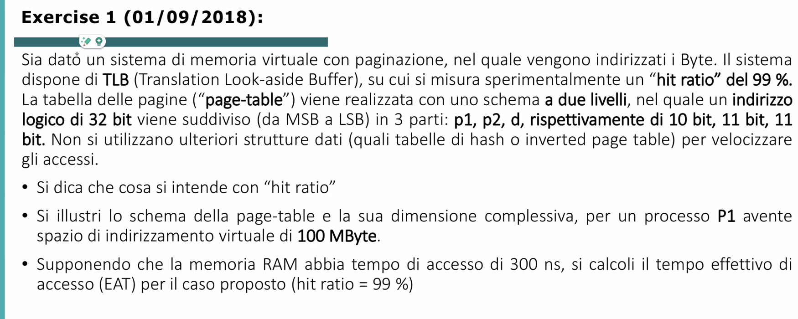

# Esercizi Capitolo 1

- [Esercizi Capitolo 1](#esercizi-capitolo-1)
  - [Esercizio 1](#esercizio-1)
  - [Esercizio 2](#esercizio-2)
  - [Esercizio 3](#esercizio-3)

## Esercizio 1

Abbiamo quindi che l’indirizzo logico è suddiviso in: 10 bit per il primo livello di page table, 11 per il secondo e 11 per l’offset.
Quindi la prima page table ha $2^{10}$ entries, la seconda invece $2^{11}$ entries.

Quindi in totale in memoria fisica abbiamo $2^{10} * 2^{11}$ frames.

Il page offset rappresenta la dimensione massima di una pagina.
Dunque in questo caso la dimensione di una pagina è: $2^{11}$.

***Dimensione complessiva:***

100MB → 128MB spazio più vicino a 100MB

128MB = $2^{27}$ Bytes di spazio necessario per P1.

Frame size: $2^{11}$ Bytes

Numero di frames necessari per P1: $2^{27}/2^{11} = 2^{16}$.

Ogni tabella contenuta nella page table di secondo livello ha $2^{11}$ entries, come abbiamo visto.
Noi dobbiamo arrivare a $2^{16}$.

Dividiamo quindi per capire quante tabelle (nella page table di livello 2) necessita P1:
$2^{16}/2^{11}=2^5$.
Quindi usiamo 5 bit nella parte d’indirizzo della pagina di livello **1** per indirizzare queste $2^5$ tabelle nella page table di livello **2**. 

C’era scritto che ogni elemento (entry di tabella) è di 4Byte quindi la dimensione complessiva è:

$$
(numpages_{P1} + (numpages_{P2} *pagesize)) *entrysize =
\\= (2^5+(2^5*2^{11}))*4B = 262.272B
$$

Recap:

32 caselle, non 25. Perchè è 2^5 = 32.

---

## Esercizio 2

***Page Table standard***:

Num pagine: $32 GB/1KB=(32*10^{30})B/(1*2^{10})B = 32*2^{20}=32M$ 

Dimensione di ogni singola pagina: 4B

Dunque dimensione PT: 32M * 4B 

***Inverted Page Table:***
Il testo dice che pagine/frames sono indirizzati con 32bit, cioè nella inverted page table la parte dedicata alla page è grande 32bit.
16bit vengono aggiunti per il pid del processo.

Dobbiamo calcolare quanti frames abbiamo in memoria: 8GB/1KB = 8M (Num. di Frames).

Dimensione inverted page table: 

$$
numframes *entrysize=numframes*(size_{pid}+size_{pagenumber})=\\=8M*(16b+32b)=8M*(2B+4B)=48MB
$$

---

## Esercizio 3

Poichè in caso di TLB miss dovremmo fare 3 accessi in memoria (uno per la page table di primo livello, uno per la page table di secondo livello e uno per leggere l’informazione cercata), avremmo 200ns * 3 = 600ns.
Dunque in conclusione l’EAT sarebbe:

$$
(0,9*200ns)+(0,1*600ns) = 240ns
$$