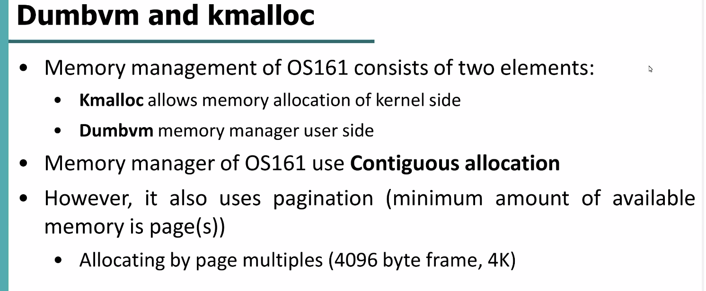

# OS161 Memory Management

- [OS161 Memory Management](#os161-memory-management)
  - [ram\_bootstrap](#ram_bootstrap)
  - [ram\_stealmem](#ram_stealmem)
  - [getppages](#getppages)
- [Solution A2](#solution-a2)
  - [free\_kpages \& as\_destroy](#free_kpages--as_destroy)
  - [getfreeppages](#getfreeppages)

OS161 usa un meccanismo di ***contiguous allocation.***

Ha anche la ***paginazione***, ma nel senso che la memoria è suddivisa in frames da **4KB**.

Un processo può avere bisogno di 10 pagine, ma devono essere allocate in 10 frames **contigui**.

L’allocazione di memoria in OS161 è effettuata su due livelli: 

- **`getppages`**  — una funzione di alto livello che è un wrapper per `ram_stealmem`
- **`ram_stealmem`** — una funzione di più basso livello (contiene codice che dipende dall’architettura su cui OS161 viene eseguito) che effettivamente alloca memoria contigua partendo dal `firstpaddr` (il primo indirizzo **fisico** disponibile, il quale viene aggiornato a seguito di ciascuna allocazione)

Il sistema di allocazione della memoria è comune a user e kernel space.
A livello user viene usata la funzione **`as_prepare_load`** , che chiama `getppages` per allocare 2 segmenti user e uno stack (ciò di cui ha bisogno un programma utente per eseguire: 2 segmenti per caricarvi il codice e i dati del programma, e lo stack).
A livello kernel viene usata la funzione **`kmalloc`** , la quale chiama `alloc_kapges` , che a sua volta chiama `getppages` .

La gestione della memoria viene chiesta dallo user space, ma anche dal kernel space.
L’OS riceve richieste di allocazione di memoria da entrambe le parti.

In OS161 ci sono 2 sistemi che rispondono alle richieste di kernel o user per allocare memoria:

- **`dumbvm.c`** , in cui troviamo la funzione `getppages`
- **`ram.c`** , in cui troviamo la funzione `ram_stealmem`

OS161 risponderà a tali richieste: prima tramite **`dumbvm.c`** e poi **`ram.c`** .

Se volessimo implementare un altro meccanismo di paging lo faremmo su dumbvm.c.
Se volessimo implementare OS161 su un’altra architettura (noi usiamo MIPS), dovremmo riscrivere ram.c (che è a basso livello e contiene codice dipendente dall’architettura).

OS161 è basato su MIPS, su processore a 32 bit e dunque indirizzi di 32 bit, dunque spazio d’indirizzamento da 4GB.
Questi 4GB vengono divisi in 4 parti:

- User Space
- Kernel space
- kseg0 → contiene strutture dati usate per l’esecuzione di kernel threads
- kseg1 →  usato per mappare dispositivi I/O
- kseg2 → non viene usato

In kseg0 carichiamo il kernel.
Dopo che finisce lo spazio allocato per il kernel, inizia lo spazio libero che può essere usato per allocare processi.

OS161 salva il primo indirizzo di memoria disponibile.

La memoria libera viene gestita tramite **`dumbvm.c`** e **`ram.c`** 

Vediamo una overview di questi due sistemi.

Quando arriva una richiesta di allocazione di memoria, i 2 sistemi si occupano di gestirla.

## ram_bootstrap

Dobbiamo sapere **dove inizia** la memoria libera e dove **finisce**.
Quando il kernel viene caricato, viene lanciata un’altra funzione (`ram_bootstrap(void)`) che chiede al controller della RAM quant’è la dimensione della RAM (`mainbus_ramsize()`) e la memorizza nella variabile `ramsize` .
Poi ricava l’indirizzo fisico di dove inizia la memoria libera.
Ciò viene fatto sottraendo al primo indirizzo logico disponibile `firstfree` la costante `MIPS_KSEG0` , che equivale a 0x80000000.

## ram_stealmem

La dimensione totale che un processo chiede quando deve essere allocato viene calcolata tramite numero di pagine necessarie * page_size (4KB).

Se la memoria richiesta è più della memoria disponibile ritorna 0 (errore).

Altrimenti assegna quella zona di memoria al processo, e quindi aggiorna l’*inizio* della memoria libera (spostandosi più avanti) e ritorna l’indirizzo di dove inizia lo spazio appena allocato.

## getppages

dumbvm.c è un wrapper di ram.c

Quindi chiama funzionalità di ram_stealmem ma aggiunge anche altre funzionalità:

Ad esempio utilizza uno spinlock — fa una mutual exclusion per dire che se processo 1 arriva prima e ha accesso, prende il lock e finchè non finisce `ram_stealmem()` nessun altro processo può accedere a `ram_stealmem()`.

Fino a qui, è tutto implementato su OS161.

Da qui inizia il nostro lavoro: la parte di ***liberare*** la memoria manca.
OS161 attualmente sa come allocare memoria, ma non sa come liberarla.

Ad esempio possiamo creare 2 nuove funzioni: freeppages e ram_freemem.

Oppure possiamo lavorare solo high-level e lasciare ram_stealmem inalterato.
Questo è ciò che faremo in laboratorio (perchè è più semplice).

Tutto quello che esiste già, eliminiamo e ripartiamo da 0.
Perchè OS161 usa meccanismo di memoria contigua, quindi l’idea sarebbe implementare il meccanismo di paging vero e proprio e quindi riscrivere tutto.
Soluzione più difficile, ovviamente.

# Solution A2

## free_kpages & as_destroy

Implementazione delle due funzioni per liberare memoria, rispettivamente per il kernel e user space.
La funzione per il kernel, `free_kpages` , innanzitutto ricava l’indirizzo fisico dall’indirizzo logico passato come parametro.
Da questo, ne ricava il corrispondente frame in RAM cui “punta”.
Dopo di che, chiama `freeppages` .

La funzione per lo user, `as_destroy` , chiama tre volte `freeppages` , passando come parametri gli indirizzi dei segmenti allocati per il processo user (dunque segmento code, segmento data, segmento stack e relative dimensioni in pagine).
Dopo di che chiama `kfree` per deallocare la struttura dell’address space del processo user.

L’inizializzazione del sistema della gestione della memoria deve quindi includere l’inizializzazione dei vettori che tengono conto di quali frames liberi abbiamo in RAM.
In particolare `freeRamFrames` è una bitmap che associa ad ogni posizione del vettore un frame in ram, con un valore che può essere 0 (frame occupato) oppure 1 (frame libero).
`allocSize` è invece un vettore grande quanto freeRamFrames, e tiene traccia del numero di pagine allocate a partire dall’indice i-esimo.
Ad esempio, se avessimo allocato 2 pagine a partire dal frame associato all’indice 10, in `allocSize[10]` troveremmo il valore 2; invece in `freeRamFrames[10]` e `freeRamFrames[11]` troveremmo degli 0, a segnare tali frames come occupati, appunto.

Quando viene fatta una richiesta di allocazione di memoria, adesso `getppages` prima di chiamare `ram_stealmem` fa una prova con `getfreeppages` , una “nuova” funzione che controlla se sono disponibili dei frames che erano stati precedentemente allocati (e magari resi disponibili al termine del processo o thread che li stava usando).
Ricorda che `ram_stealmem` non fa altro che allocare memoria partendo dal primo indirizzo fisico libero disponibile (il quale viene aggiornato a seguito di ciascuna allocazione), senza tenere conto appunto se “prima” di tale indirizzo fisico si è liberato dello spazio.
Per questo intercediamo prima provando a chiamare `getfreeppages` , che tramite i vettori che abbiamo implementato si occupa di gestire esattamente questo meccanismo.

## getfreeppages

La funzione `getfreeppages` prende come parametro il numero di pagine che vorremmo allocare.
Inizia quindi a scorrere il vettore `freeRamFrames` finchè non troviamo una posizione settata ad 1, cioè frame libero.
Quando questo viene trovato, viene memorizzato l’indice come `first`, cioè abbiamo trovato la prima posizione a partire dalla quale potremmo trovare dei frames liberi.
Dobbiamo vedere però, se a partire da tale posizione, abbiamo tanti frames liberi quanti ce ne servono (npages).
Questo viene fatto tramite il secondo if, che ad ogni iterazione del for controlla se l’indice che stiamo esaminando è maggiore o uguale a `np` , vale a dire se abbiamo trovato `np` frames liberi.
Se è così, allora usciamo dal ciclo e segnamo questi frames come ora occupati (li stiamo prendendo noi), e segniamo `np` nella posizione `found` di `allocSize` (cioè segnamo quante pagine stiamo allocando a partire dal frame di indice `found`).
Dopo di che calcoliamo l’indirizzo da restituire, e lo restituiamo.

---