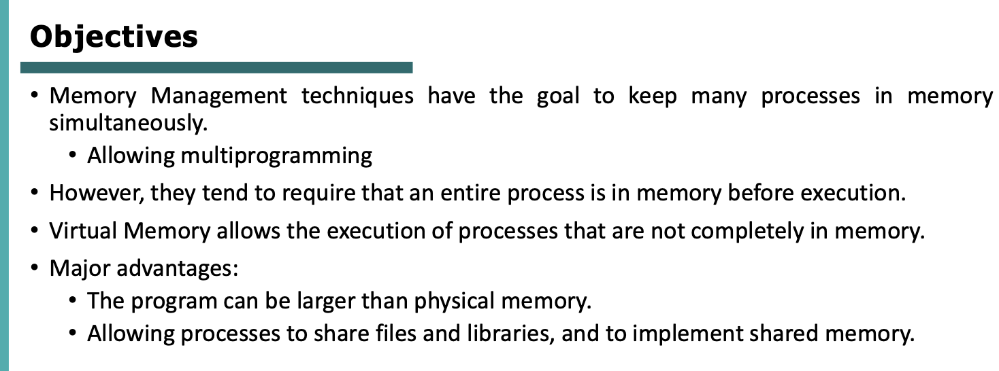

# Virtual Memory

- [Virtual Memory](#virtual-memory)
  - [Overview](#overview)
  - [Demand paging](#demand-paging)
    - [Pure demand paging](#pure-demand-paging)
    - [Free-Frame List](#free-frame-list)
  - [Copy-on-Write](#copy-on-write)
  - [Page replacement](#page-replacement)
    - [Dirty bit](#dirty-bit)
  - [Page Replacement Algorithms](#page-replacement-algorithms)
    - [FIFO](#fifo)
    - [Optimal Algorithm](#optimal-algorithm)
    - [Least Recently Used](#least-recently-used)
    - [Second-chance](#second-chance)
    - [Enhanced Second-Chance](#enhanced-second-chance)
    - [Counting-based Algorithms (LFU, MFU)](#counting-based-algorithms-lfu-mfu)
    - [Page-Buffering Algorithms](#page-buffering-algorithms)
  - [Esercizi](#esercizi)
    - [Esercizio 1](#esercizio-1)
    - [Esercizio 2](#esercizio-2)
    - [Esercizio 3](#esercizio-3)
    - [Esercizio 4](#esercizio-4)
  - [Summary](#summary)
  - [Allocation of Frames](#allocation-of-frames)
    - [Equal Allocation](#equal-allocation)
    - [Proportional Allocation](#proportional-allocation)
    - [Global and Local replacement](#global-and-local-replacement)
    - [Reclaiming Pages](#reclaiming-pages)
    - [Non-Uniform Memory Access](#non-uniform-memory-access)
    - [Trashing](#trashing)
    - [Working-Set Model](#working-set-model)

## Overview

La CPU genera il logical address (32b, 64b etc.. a seconda dell’architettura), dobbiamo mappare tale indirizzo con l’indirizzo fisico.
Questo è ciò che fa la MMU.

L’indirizzo fisico fa riferimento ad una zona della memoria, che contiene un’istruzione o un dato.

Ad esempio, se l’indirizzo è a 32bit, dunque l’indirizzo è grande 4 Byte.
Dentro la zona di memoria indirizzata dall’indirizzo fisico, troviamo qualcosa che può avere una certa dimensione, solitamente 1 Byte (dunque 1 Byte di dati o istruzione).

Tutto ciò che abbiamo studiato finora è per sfruttare la memoria che abbiamo e mettere più processi possibili in esecuzione.

Finora il logical space di cui abbiamo parlato era limitato dalla dimensione della physical memory: cioè se ho 1GB di memoria fisica, non possiamo avere una logical memory più grande di 1GB.

Concetto base: vorrei un modo che separi logical memory e physical memory.
Se un processo ha bisogno di 100MB di spazio, a noi non serve 100MB di spazio in memoria fisica, ma abbiamo qualche pagina del processo che ***non è mappata*** in logical memory.
Quando un processo è in esecuzione, non tutte le sue pagine sono in memoria.

Se ragioniamo così, disaccoppiando logical memory e physical memory, possiamo immaginare di avere una logical memory molto più grande della physical memory.

Dunque se un processo ha 10 pagine, all’inizio non servono tutte e 10 le pagine, magari ne servono solo 2, quindi carico quelle e mano a mano che il processo esegue, se serve porto le altre in memoria.

Noi studieremo la tecnica di ***Demand paging***.

## Demand paging

Carichiamo una pagina del processo solo quando è richiesta.
Con il Demand Paging limitiamo anche le operazioni di I/O, perchè il caricare o scaricare pagine da/verso il disco viene fatto solo quando necessario, invece di caricare tutte le pagine del processo direttamente, e in caso scaricarle di nuovo tutte in caso di swapping.

*Come fa il processo a sapere se le pagine di cui ha bisogno sono in memoria?*
Il processo deve controllare se una certa pagina è già in memoria, e quindi eseguirla, oppure se non è in memoria deve caricarla dal disco.

Per capirlo, esiste il ***valid-invalid*** bit, che troviamo nella page table.
Se un processo ha bisogno di una certa pagina, si cerca il mapping page-frame nella page table, se il bit di validità è valido, allora vuol dire che la pagina è in memoria e quindi può essere eseguita.
Se non è valido, vuol dire che la pagina non è in memoria e quindi va recuperata dal disco.

Ogni processo ha la sua page table.
Immaginiamo che un processo abbia bisogno di 5 pagine.
Per indirizzare 5 pagine abbiamo bisogno di 3 bit. Con 3 bit però posso indirizzare 8 pagine, quindi solo 5 indirizzi logici vengono usati dal processo, gli altri 3 indirizzi logici sono nella page table ma **non fanno parte** della logical memory del processo, e saranno quindi contrassegnati come **non validi**.

E se la pagina non si trova in memoria?
Si ha un ***page fault***, per cui la pagina non è in memoria, ma è sul disco e deve essere recuperata.
I passi che il SO segue quando si verifica un page fault sono 6:

Andiamo nella page table, controlliamo il validity bit per capire se la pagina in memoria è valida oppure no.
Se è valido, eseguiamo la pagina, altrimenti se non è valido e non fa parte della memoria logica del processo, esso sta compiendo un’azione illegale e quindi viene terminato.

Se non è valido, ma fa parte della memoria logica, allora l’operazione è valida ma la pagina deve essere recuperata dal disco.

Dunque dobbiamo trovare un frame libero per allocare la pagina da caricare dal disco.

Una volta trovato il frame libero, dobbiamo fare una operazione di I/O per scrivere la pagina sul frame libero.

Una volta fatto ciò possiamo segnare l’entry nella Page Table mettendo il bit di validità a *valido,* e scriviamo il frame number a cui si trova la pagina richiesta.

Il processo può ora riprendere da dove aveva lasciato e continuare la sua esecuzione.

Nel procedimento appena descritto ci sono tante scelte che devono essere prese.
Es: *quando inizia l’esecuzione di un processo, quante pagine carichiamo in memoria?*
*Zero, e mano a mano carichiamo quella necessaria?*
*Oppure un po’? Se sì, quante?*

### Pure demand paging

***Pure demand paging***: inizio un processo caricando **zero** pagine in memoria.
Alla prima istruzione di cui abbiamo bisogno, avviene un page fault e quindi mano a mano carichiamo le pagine.
In questo caso il processo è molto lento, perchè tutte le istruzioni e dati di cui può avere bisogno non sono in memoria, e devono essere portate dal disco quando vengono richieste.

Se devo fare una somma (istruzione somma), oltre all’istruzione devo prelevare anche i dati che devono essere coinvolti nella somma.
Quindi se questi dati si trovano in una pagina diversa da quella dell’istruzione, si possono verificare 2 page faults: uno per la pagina che contiene l’istruzione e uno per la pagina dei dati.

Più avanti studieremo il concetto di ***locality of reference:*** un processo usa il 20% delle sue pagine **molto di più** dell’80% restante delle pagine.
Questo perchè spesso gran parte del programma è fatto da funzioni di controllo o di handlers d’eccezioni che non vengono eseguite spesso, ma solo in casi eccezionali.

Quando dobbiamo liberare un frame per fare spazio per altri processi o altre pagine, tutte queste informazioni vengono prese in considerazione per fare una scelta accurata.

### Free-Frame List

Come possiamo sapere quali frame sono liberi?
Nel SO c’è una struttura dati (una lista) che viene usata come *pool* per memorizzare i frames liberi.

Quando liberiamo un frame, scarichiamo sul disco la pagina che stiamo deallocando, e poi **azzeriamo tutto il contenuto** del frame che stiamo liberando, per garantire la privacy tra processi (tecnica ***zero-fill-on-demand***).

**Demand Paging**: buono perchè non portiamo tutte le pagine di un processo in memoria, lasciando molto spazio libero per altri processi.
Però è una tecnica con performances basse (lentezza).
Assumiamo un access-time di 10ns, se non abbiamo PF allora ottimo e facciamo 1 solo accesso alla memoria (quando leggiamo il dato/istruzione, senza considerare l’accesso per la page table).
Se abbiamo PF, prima dobbiamo leggere la pagina dal disco e caricarla su un frame libero (se c’è) in memoria.
Questa operazione richiede molto tempo, e tale tempo lo chiamiamo ***page fault time***.
Quindi se $p$ è la probabilità di avere un PF, posso calcolare l’EAT con la formula mostrata in slide, dove $(1-p)$ è la probabilità di **non** avere un PF.

Vediamo più nel dettaglio cosa succede quando si verifica un PF.
Scaturisce una trap che comunica al processore che il processo non può continuare ad eseguire.
Si salva lo stato del processo (registri e contesto).
Si determina se si è avuto effettivamente un PF o no.
Se sì, si controlla che l’indirizzo logico richiesto sia legale (all’interno del logical space) e se sì, si determina la posizione della pagina richiesta su disco.
Dunque si richiede una lettura dal disco su un frame libero in memoria principale.
Però può essere che il disco sia occupato già in un’altra operazione di I/O, quindi in caso bisogna attendere che il disco possa soddisfare la nostra richiesta.

Se il disco è occupato, possiamo dare CPU time ad altri processi e quando il disco è pronto a soddisfare la nostra richiesta, la CPU riceve un’interrupt.
Dunque si fa context switch del processo che stava eseguendo, aggiorniamo la page table del nostro processo per segnare che la pagina richiesta è ora in memoria, e si attende affinchè la CPU possa eseguire di nuovo il nostro processo (quando verrà rischedulato).
Quanto descritto è il **worst case** di quello che può succedere in caso di page fault.

Vogliamo portare meno pagine in memoria (+spazio libero in memoria) ma con il rischio di avere tanti PF, oppure avere più pagine in memoria (-spazio in memoria) e avere meno PF (+velocità).

## Copy-on-Write

Abbiamo detto che un processo può creare processi figli tramite ***fork***.
Tutto ciò che succede *dopo* la fork viene visto sia dal padre che dal figlio.
Il contesto del processo padre viene copiato e la copia viene allocata per l’uso del processo figlio.
Ma in realtà ciò che succede è che la porzione di memoria (eventualmente più pagine) dedicata al processo padre viene effettivamente copiata e riallocata in una nuova zona di memoria per il figlio solo se questo vuole modificare la zona di memoria.
Ma fino a quel momento il processo figlio ha accesso alla stessa pagina del padre, con cui la condivide.

## Page replacement

Se stiamo mettendo **troppi** processi in esecuzione in contemporanea, potremmo trovarci con la memoria piena, e tutti i processi incorreranno in PF.
Dunque la CPU verrà impegnata per la maggior parte del tempo a gestire PF per swappare pagine, invece di dedicare questo tempo a effettivamente eseguire i processi.

Con il demand paging possiamo però ora fare swapping “parziale” tra processi: cioè se dobbiamo fare spazio in memoria per un nuovo processo, magari non deallochiamo *tutte* le pagine di un processo, ma solo alcune, consentendo quindi al processo di continuare a eseguire e poi se necessario (dopo un PF) caricare altre pagine in memoria.

Tra le pagine caricate in memoria, bisogna scegliere quale “sacrificare” per fare spazio.
Vedremo poi come effettivamente fare questa scelta (*Random*, *Last Recently Used*, *Least Frequently Used* etc..).

---

**— LEZIONE 8/04/24**

### Dirty bit

Quando avviene un PF, sono necessari due trasferimenti di pages: uno che scarica la victim page su HDD, e uno che carica un’altra page in RAM.

Usiamo il ***dirty bit*** per ottimizzare il processo di page replacement.
Se una pagina viene solo letta, e non modificata, possiamo tenere il dirty bit a 0, anche se l’abbiamo letta.
La page, che può essere selezionata come ***victim page*** per essere sostituita, non ha dunque bisogno di essere trasferita su HDD, perchè esiste già una copia **non modificata** della page in HDD.

Due problemi da risolvere nel contesto del Demand Paging:

- *Quanti frames dobbiamo avere disponibili per ogni processo, all’inizio della loro esecuzione?*
Ne riserviamo solo uno, come nel ***Pure Demand Paging***?
Oppure esistono altre strategie?
- *Se dobbiamo sostituire una page in RAM, quale scegliamo?*
Che algoritmo usiamo per scegliere la ***victim page***?

## Page Replacement Algorithms

Per rispondere alla seconda domanda, dovremmo stabilire un criterio che ci permetta di valutare le performance di un algoritmo piuttosto che di un altro.

*Come valutiamo quindi le performances degli algoritmi usati per scegliere la victim page?*
Calcoliamo il numero di PF che ogni algoritmo fa.
Vorremmo un numero di PF il più basso possibile → sistema più “veloce” (nel senso che dedica più tempo ad eseguire effettivamente i nostri processi, piuttosto che overhead per gestione della memoria).

### FIFO

Prima page caricata in memoria → è anche la prima selezionata per essere sostituita.

Potremmo pensare intuitivamente che se abbiamo più frames a disposizione, il numero di PF dovrebbe diminuire.
In realtà con FIFO non è esattamente così, perchè FIFO tiene conto solo del tempo di arrivo delle pages in memoria.

FIFO non tiene conto se la pagina caricata da più tempo in RAM (quindi la victim page di FIFO) è stata usata più volte, o se è stata modificata, o se è stata usata recentemente etc..

### Optimal Algorithm

Sostituiamo la pagina che sappiamo *non verrà usata per un tempo maggiore rispetto alle altre*.

Il problema di questo algoritmo è che noi **non possiamo sapere** quali sono le pagine che verranno usate in futuro.
In linea teorica è l’algoritmo più efficiente, ma non possiamo implementarlo.
Quindi studiamo altri algoritmi che possano avvicinarsi più o meno alle sue prestazioni.

### Least Recently Used

In ***LRU*** andiamo a guardare il passato, piuttosto che il futuro come nell’***Optimal Algorithm***.
Andiamo a sostituire la pagina che è stata usata più lontano nel tempo (passato).

*Come possiamo implementarlo?*
Dobbiamo tenere conto di *quando* una pagina è stata chiamata.

Due tecniche:

**Counter**

Svantaggi: dobbiamo leggere tutta la page table per trovare la pagina meno recentemente usata, e inoltre ad ogni accesso in memoria dobbiamo anche scrivere (per aggiornare il contatore).

**Stack**

A fondo dello stack troviamo la pagina usata meno recentemente, nella cima invece la pagina usata più recentemente.
Dunque la pagina usata più recentemente è sempre sul top dello stack.

***Reference bit***: viene posto a 1 se la pagina viene *referenziata* (cioè viene letta o scritta, indipendentemente).

Con questo bit possiamo sapere quali pagine sono state usate, ma non possiamo sapere **quante volte, o in quale ordine.**

Dopo tot tempo controlliamo quali pagine sono state usate tramite il **Reference bit**, e buttiamo fuori una pagina con **Reference bit** a **0**.

### Second-chance

FIFO ma con l’aggiunta del **Reference bit**.
Quando stiamo per sostituire la pagina secondo FIFO, controlliamo il suo Reference Bit.
Se è 0, vuol dire che da quando è stata caricata in memoria **non è stata usata**, quindi possiamo sostituirla.
Se è 1, le diamo una ***second chance*** e ci spostiamo sulla prossima pagina della coda FIFO, ripetendo il procedimento.
Quando una pagina ottiene una **second chance**, il suo Reference bit viene resettato a 0 e il suo *arrival time* viene resettato al tempo attuale.

Notiamo che stiamo usando un **circular buffer**, per cui quando carichiamo una nuova pagina in memoria, il puntatore all’inizio del buffer viene **spostato** in modo che la nuova pagina risulti essere l’**ultima** pagina del buffer.

### Enhanced Second-Chance

Algoritmo più completo che include le informazioni di **Reference bit** e **Dirty bit**.

### Counting-based Algorithms (LFU, MFU)

### Page-Buffering Algorithms

---

## Esercizi

### Esercizio 1

**LRU**

**Optimal Replacement**

### Esercizio 2

(DA FARE)

### Esercizio 3

*(ESERCIZIO SIMILE ALL’ESAME)*

In ogni pagina, che è grande 200, possiamo ospitare due *iterazioni* dell’array, quindi ad esempio [0][0..99] e [1][0..99].
In totale abbiamo dunque bisogno di 50 pagine (da 0 a 49) per memorizzare l’array.

Sappiamo poi che il primo page frame viene usato per contenere il processo.
Abbiamo quindi 2 frames disponibili per caricare pagine di array.

Nel ciclo a), si ha che abbiamo un page fault ogni 2 elementi di indice i (ciclo interno), ma poi c’è il ciclo esterno (di j) che ripete i page faults.
Quindi in totale abbiamo: 50PF per il ciclo interno **x** 100 (iterazioni del ciclo esterno) = 5000 PF totali.

Vediamo il ciclo b).
Abbiamo solo un PF iniziale quando referenziamo A[0][1], e portiamo in f0 p0, che contiene le prime 2 iterate dell’array.
Per com’è scritto il ciclo, non ci sono altri PF finchè non raggiungiamo A[2][0].
Quindi in totale abbiamo 50PF!

### Esercizio 4

Prima cosa da fare: capire in che pagine si trovano le parole referenziate.
1000 / 200 = 5 → 5 pagine in totale per memorizzare 1000 parole.

261 → Seconda pagina: partendo da p0, sta su **p1**
409 → Terza pagina: **p2**

E così via..

Ricorda che partiamo da 0, quindi p0 = da 0 a 199. 
p1 = da 200 a 399.
p2 = da 400 a 599 etc..

Per capire direttamente ad esempio dove si trova 985, facciamo 985 / 200 = 4,…
Cioè 4 virgola qualcosa → 985 si trova nella **quinta** pagina → **p4**

Passiamo ora all’esercizio vero e proprio: arriva p1, ma vediamo che è già in memoria, quindi non c’è PF ma dobbiamo cambiare il Reference bit: da 0 a 1.
Il puntatore di FIFO in questo caso non cambia, rimane su p4.

Arriva p2, e dobbiamo sostituire una pagina.
FIFO punta a p4, che ha Reference bit a 0, quindi possiamo sostituire.
Il puntatore FIFO si sposta su p3.

Arriva p4, e dovremmo sostituire p3. Ma p3 ha Reference bit a 1 → Quindi second chance: manteniamo p3, cambiamo il Reference bit da 1 a 0 e spostiamo avanti il puntatore (dunque su p1). 
Lo stesso succede con p1, quindi sostituiamo p2.
Il puntatore ritorna su p3.

E così via..

Nel caso in cui abbiamo tutte e tre le pagine con reference bit a 1, si azzerano tutti perchè la pagina viene selezionata per la sostituzione, ma con Reference bit a 1 si dà second chance e quindi si mette a 0 e si sposta il puntatore.
Alla fine si avranno tutti a 0 e il puntatore torna su 2, che verrà sostituito.

Alla fine si ha:

---

**— LEZIONE 15/04/24**

## Summary

Non ci piace che un processo porti in memoria tutta la sua memoria anche quando non è necessario.
Quindi abbiamo pensato di dividere la memoria di un processo in pagine, e portiamo in RAM solo quelle necessarie.
Se la page che serve al processo ad un certo punto non è presente in RAM, si ha un PF che verrà gestito per portare la pagina richiesta in RAM.
Se non c’è spazio, bisogna sostituire una pagina già presente in memoria.

Abbiamo quindi visto i meccanismi di ***page replacement***.

Dobbiamo gestire 2 cose:

- **Page-replacement**
- **Frame-allocation**
Se abbiamo più di un processo, come dividiamo i frames di RAM disponibili tra questi processi?

## Allocation of Frames

Prima idea di Frame Allocation: ***pure demand paging***.

Immaginiamo di avere P1 e P2 che voglio eseguire, e che abbiamo 93 frames liberi.

Nel *pure demand paging* non stiamo tenendo conto di quanti frames stiamo allocando per ogni processo: ogni processo che fa PF ottiene “indiscriminatamente” un nuovo frame.

Vediamo altre soluzioni — vorremmo dedicare un numero minimo di frames ad ***ogni processo***.

Se abbiamo sempre 93 frames liberi e P1 e P2 da voler eseguire, quanti frames dovremmo allocare per P1 e P2?

Due strategie:

- **Equal Allocation**
- **Proportional Allocation**

### Equal Allocation

Dividiamo il numero di frames liberi totale per il numero di processi.
Ad esempio, avendo 93 frames e 5 processi, ogni processo otterebbe 18 frames.
*Svantaggi*: può succedere che un processo non abbia bisogno di tutti i 18 frames, magari ha bisogno di meno frames.
Inoltre in questo modo non teniamo conto della priorità dei processi.

### Proportional Allocation

Allocare la memoria disponibile ad ogni processo tenendo conto della dimensione del processo.
Se P1 è più grande di P2, P1 dovrebbe avere più frames rispetto a P2.
Diamo dei “pesi” quindi, dati dal rapporto tra il numero di pagine di cui ha bisogno il processo, fratto la somma di pagine necessarie per tutti i processi.
Quindi i frames assegnati ai due processi sono rispettivamente:

$$
P_1 = \frac{10}{137}*62=4,55=>4 \;\;\;\;\;\;\;\;\;
P_2 = \frac{127}{137}*62=57,47=>57
$$

In tutte e due le strategie, quando arriva un processo nuovo, i processi in esecuzione devono liberare un po’ dei loro frames, per dare un po’ di memoria al nuovo processo.
Quanti ne devono liberare dipende se stiamo usando Equal Allocation o Proportional Allocation.

Possiamo essere più raffinati nell’allocazione della memoria per i processi: ad esempio tenendo conto della priorità dei processi.

### Global and Local replacement

Quando allochiamo un minimo numero di frames ad ogni processo, ovviamente non è detto che quei frames bastino per il processo.
Quindi se la memoria è piena e il processo richiede un’altra pagina, dovremo liberare un frame dallo stesso processo, o da un altro.
Esistono 2 categorie di strategie di replacement.

Quando un processo ha bisogno di potare in RAM una pagina, l’operazione di sostituzione la può fare su ***tutti i frames*** del sistema, anche se il frame è occupato da un altro processo.
In questo caso il set di frames allocati non dipende solo dal processo stesso, ma anche dagli altri processi in esecuzione: se anche gli altri fanno PF, le sostituzioni possono impattare sul processo che stiamo valutando (perchè anch’esso può vedersi sottratti dei frames).

L’altra strategia si chiama Local Allocation — Quando il processo ha bisogno di un frame libero va a scegliere solo tra i frames dedicati al processo stesso.
In questo caso è più facile fare predizioni sul comportamento del processo.

### Reclaiming Pages

Tutto ciò che abbiamo detto va bene ma creerà una coda per i processi.
Un altro algoritmo è **Reclaiming Pages**, che fa parte della categoria *global page replacement*.

Invece di chiedere frames al momento del bisogno, creiamo un pool di frames liberi e definiamo 2 thresholds:

- Massimo
- Minimo

Ad esempio possiamo decidere di avere **sempre** un numero minimo e massimo di frames nel nostro sistema.
Quando arriviamo sotto il minimo, viene chiamata una routine (`reaper`) che chiede a tutti i processi di liberare frames.
Questo processo continua finchè non superiamo il numero massimo.

### Non-Uniform Memory Access

Finora, quando abbiamo parlato di processo e di memoria, abbiamo considerato l’accesso alla memoria come un valore costante, es 10ns.
Ma in realtà, se abbiamo sistemi con più di una CPU, non abbiamo lo stesso valore per tutti i processi.

Ad esempio, se abbiamo 4 CPU, ogni cpu ha una sua local memory vicina.
Il tempo di accesso alla memoria che è fisicamente vicina alla CPU è più basso rispetto al tempo di accesso in memorie più lontane.
Ad esempio CPU0→Mem0 è più breve di CPU0→Mem1.

### Trashing

Ultimo concetto importante di Virtual Memory: ***Trashing***.

Immaginiamo di allocare un minimo numero di frames ad un processo, immaginiamo che non sia abbastanza per il processo.
Se P1, ad esempio, ha 5 pagine allocate, ma ha bisogno in totale di 150 pagine, P1 avrà molti PF.
Quando fa PF dovrà scaricare su disco una pagina attiva, di cui avrà di nuovo bisogno a breve, e quindi causerà anch’essa un PF a breve! → PF rate molto alto!

Il processo spende più tempo a spostare le pagine avanti e indietro dal disco, rispetto al tempo che impiega per effettivamente eseguire.
Questo significa che il processo è in ***trashing***.

Abbiamo allocato un numero basso di frames al processo, e fa PF così spesso che alla fine il tempo che impiega a gestirli è di più del tempo che impiega per eseguire.

Quando un processo è in trashing, la CPU utilization è molto bassa, quindi la CPU pensa che non ha molto carico di lavoro, e quindi aggiunge un altro processo alla coda di scheduling, peggiorando soltanto la situazione!

Vediamo dal grafico che avremo un crescendo di CPU utilization, poi i processi faranno molti PF e saranno in coda di I/O, e la coda di scheduling della CPU sarà vuota → la CPU carica altri processi perchè pensa di non avere carico di lavoro.

### Working-Set Model

Possiamo risolvere il trashing tramite una tecnica di **Local Replacement Algorithm**.
Ogni processo va a prendere dai suoi frames, quando deve liberare un frame in seguito a PF.
Possiamo usare il Locality model: dedichiamo un numero minimo adeguato di frames ad ogni processo, per evitare che vadano in trashing.

Di solito il numero di pagine in stato di **attivo** vengono usate insieme.
Ad esempio una funzione, su una pagina, che ha bisogno di chiamare altre funzioni presenti su altre pagine → le pagine sono attive. Le pagine vengono usate insieme.
Quando quel pezzo di codice sarà finito, avremo alcuni PF per portare in RAM il prossimo locality model del processo.
Quando tutto il *working set* sarà caricato, non avremo PF di nuovo per tot tempo (finchè questo nuovo pezzo di codice non viene eseguito tutto).

Basta capire qual è il locality model di ogni processo per capire il numero minimo di frames di cui il processo ha bisogno.

Basta che definiamo un Working-Set Model basato sulla località spaziale e temporale.
Usiamo un parametro delta per definire la finestra temporale del working-set.

Delta è il tempo che intercorre tra i momenti in cui calcoliamo il working set nuovo che serve al processo.
Come scegliamo questo delta? È variabile.

Piuttosto che *guardare nel futuro* (impossibile) guardiamo nel passato.

Per ogni processo monitoriamo il PF rate — se è troppo alto vuol dire che il processo ha bisogno di più frames, se è troppo basso, il processo potrebbe avere troppi frames allocati.