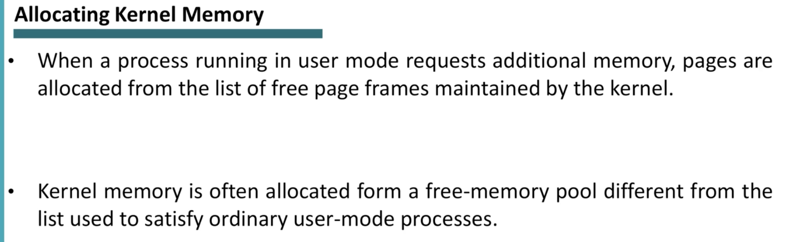

# Kernel Virtual Memory Allocation

- [Kernel Virtual Memory Allocation](#kernel-virtual-memory-allocation)
  - [Overview](#overview)
  - [Buddy System](#buddy-system)
  - [Slab Allocation](#slab-allocation)

## Overview

Abbiamo detto precedentemente che non dobbiamo solo allocare memoria per lo user space, ma anche memoria per il kernel.
Dobbiamo vedere i metodi usati per allocare memoria al kernel.

Di solito l’allocazione di memoria per il kernel viene fatta in modo **contiguo**.
Dobbiamo ricordarci che di solito sappiamo già da prima la struttura dati del kernel, è qualcosa di predefinito, sappiamo già di quanta memoria ha bisogno e che tipo di strutture dati deve allocare.

Quindi allochiamo memoria tramite una struttura dati predefinita.
Di solito vengono usati 2 metodi per allocare memoria kernel:

- **Buddy System**
- **Slab Allocation**

## Buddy System

L’idea è di avere ***fixed-size segments*** di memoria (dimensione fissa) e allocazione di pagine contigua.
Un’altra caratteristica del buddy system è che si basa su potenze di 2.

Es:

Immaginiamo di avere uno spazio contiguo di pagine in memoria fisica di 256KB.
Il kernel richiede 21KB di memoria.
Buddy System divide la memoria in 2 iterativamente, fino ad arrivare a ottenere un pezzetto di memoria di 32KB (potenza di 2 più vicina a contenere 21KB).

Se il kernel avrà poi bisogno di più memoria, può fare il **merge** dei blocchi di memoria creati per arrivare ad esempio a 64KB, o 128KB etc..
Questa tecnica si chiama ***Coalescing***.

## Slab Allocation

Usato ad esempio su Linux.
Strategia che *“fa gruppi dei diversi blocchi della memoria, e poi crea un pool di questi blocchi che il kernel può poi usare”*.
Sappiamo che la memoria che il kernel chiede è qualcosa di predefinito: sappiamo ad esempio come è definita e quanta memoria richiede un ***Thread Control Block*** (di solito 3KB), oppure ***Process Control Block*** (7KB).
L’idea quindi è suddividere la memoria in blocchi da 3KB o 7KB, formare quindi dei gruppi di blocchi di 3KB o 7KB, e posizionare tali gruppi in una zona di memoria che chiamiamo ***cache*** (non è la cache dei processori che conosciamo, è una zona di memoria che identifichiamo come “*pool di gruppi di blocchi di dimensione fissa*”).

Quando il kernel chiede memoria per queste varie strutture dati, va a prendere blocchi che sono disponibili in questo pool di memoria.
Abbiamo gruppi di memoria da 3KB o da 7KB.

Quando il kernel chiede di avere memoria, ad esempio per un TCB da 3KB, gli viene comunque riservato un gruppo di questi blocchi (quindi, come in slide, invece di dargli 3KB di spazio, gli diamo un gruppo di 4 spazi da 3KB ciascuno), e li va a “fillare” con i suoi oggetti finchè non esaurisce i blocchi del gruppo.
Quando finiscono i blocchi di un gruppo, alla richiesta di memoria successiva richiederà un altro gruppo di blocchi, e così via..
Dobbiamo ricordare che in questa tecnica non è possibile avere dei “singoli” blocchi da 3KB in cache, ma sempre e solo gruppi di dimensione fissa che contengono blocchi da 3KB.

