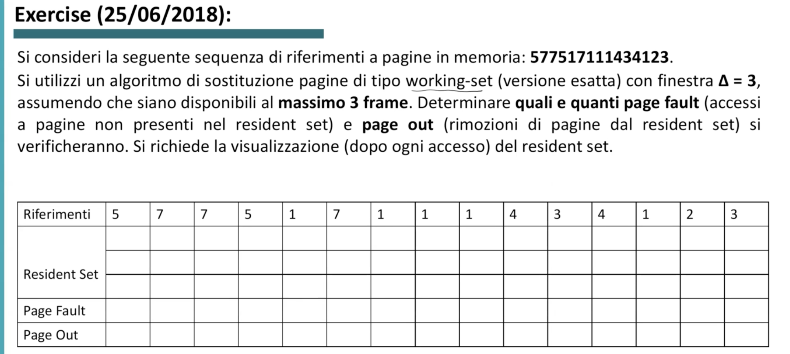

# Esercizi

- [Esercizi](#esercizi)
    - [Esercizio 1](#esercizio-1)
    - [Esercizio 2](#esercizio-2)
    - [Esercizio 3](#esercizio-3)
    - [Esercizio 4](#esercizio-4)
    - [Esercizio 5](#esercizio-5)

### Esercizio 1

Vediamo i primi passi: all’inizio abbiamo i 3 frames liberi. 
Riferimento a page 5: non è presente, la carichiamo in seguito ad un page fault.
Riferimento a page 7: non è presente, la carichiamo in seguito ad un page fault.
Riferimento a page 7: è presente, non c’è page fault.
Notiamo che allo stato attuale il working-set è **`577`**  (le ultime 3 pagine referenziate).

Vediamo che qui però, essendo il working-set diventato **`171`** , dobbiamo fare un **page-out** su 5, che appunto non fa più parte del working-set e quindi eliminiamo dalla memoria.

E così via fino alla fine:

In totale abbiamo 8 PF e 5 PO.

---

### Esercizio 2

Basta leggere la domanda per capire cosa bisogna fare, il risultato è:

---

### Esercizio 3

---

### Esercizio 4

Altro esercizio, parte **A)**

Abbiamo detto che un indirizzo, creato dalla CPU, viene separato in 2: page offset e page number.
Quanti bit sono dedicati all’una e l’altra parte dipende da dimensione massima della pagina e massimo numero di pagine che possiamo avere nel sistema.

Ricordiamo qui il meccanismo per ricavare l’indirizzo fisico a cui troviamo la page referenziata dalla CPU.

Torniamo all’esercizio..
Abbiamo page size da 128B, dunque $128B = 2^7$ ⇒ **7 bit di offset**.
L’ultimo accesso in memoria è **C10** = `1100 0001 0000`.
Avendo 7 bit per l’offset si ha quindi: `11000 0010000`, da cui possiamo estrarre il page number: `11000` = 8+16 = 24.

Sapendo quindi che 7 bit sono dedicati all’offset, i rimanenti 5 bit sono dunque dedicati al page number. Il che vuol dire che il numero totale di pagine indirizzabili è: $2^5 = 32$. 

Ci potevamo arrivare anche sapendo che:

- page size = **128 Byte**
- indirizzi logici (e in questo caso anche fisici) a **12 bit**
- ogni indirizzo referenzia **1 Byte**

Si ha dunque che: $2^{12} = 4096$ (4096 Byte indirizzati) → $4096B/128B = 32$ (4096B in totale raggruppati a 128B, che è il page size).

Però (*ho cappato io*), il testo dell’esercizio vuole sapere di quante pagine in totale dispone il programma, e sapendo che il massimo indirizzo utilizzabile dal programma è **C10**, che è uguale a 24, ciò vuol dire che il programma ha in totale **25 pagine** (da 0 a 24).
Abbiamo quindi calcolato, come richiesto, *quante pagine sono presenti nello spazio di indirizzamento **del programma***.

Vediamo ora di calcolarne *la frammentazione interna*.

<aside>
💡 Ricordiamo: ho frammentazione interna quando, come ad esempio in questo caso, ho pagine da 128B, ma magari il programma ha bisogno di allocare **meno** di 128B di memoria. Dunque gli viene assegnato uno spazio da 128B, ma non lo usa tutto.

</aside>

Sappiamo che il programma ha usato fino alla pagina 24, ma di questa pagina sono stati usati tutti i 128B?

Prendiamo dunque l’indirizzo della page 24: **C10.**
Si ha che il dato referenziato si trova a 17 Bytes (da 0 a 16) dall’inizio della page (ricorda che C10 = `11000 0010000` , di cui 7 bit di offset, che in questo caso `0010000 = 16`).
Dunque abbiamo $128B - 17B = 111B$ di ***internal fragmentation***.

---

*Stesso esercizio, parte **B)***

Abbiamo quindi 7 bit di offset e 5 di page number, dunque facile trovare le pagine corrispondenti:

Dobbiamo portare queste pagine in memoria, e nel caso in cui il programma faccia riferimento ad una page non presente in memoria, ho un page fault:

Ricordiamo come funziona LRU.

Alla fine si ha:

In totale abbiamo 9 PF.

Dobbiamo ricavare il frame number dove viene posizionata la page 7, che ha indirizzo logico 3F5.
L’offset è uguale, ma cambia la parte dedicata al page number (ovviamente).
Dunque, dato che facendo l’esercizio sappiamo che la page 7 viene messa all’indirizzo fisico 780, ricaviamo da questo indirizzo il frame number:

780 = 0111 1000 0000 → **`01111 0000000`** → Frame number = 01111 = **15**

Sostituiamo alla parte del page number nell’indirizzo logico della page 7: 00111 1110101 → **`01111 1110101` ⇒ 7F5**

Dunque in conclusione:

---

### Esercizio 5

Ricordiamo come funziona Enhanced Second-Chance:

Dunque avendo 8 pages in totale, usiamo 3 bit per indirizzare le pages.
Di conseguenza, avendo indirizzi logici a 12 bit, i restanti 9 bits sono di offset.

In **Enhanced Second-Chance**, per ogni pagina dobbiamo considerare il ***reference bit*** e il ***modify bit***.

Ad esempio — primo accesso a page 1: abbiamo un PF, lo portiamo in memoria per operazione di Write, dunque il modify bit diventa 1, mentre il reference bit rimane 0 dato che abbiamo appena portato in memoria la page.
Al secondo accesso, in lettura, il modify bit rimane 1, e in questo momento diventa 1 anche il reference bit!

E così via..

*Che succede quando dobbiamo sostituire una page?*
Vediamo che arriva la page 3.
Iniziamo dalla prima page in memoria, la page 1, e vediamo che che ha reference bit a 1, quindi lo portiamo a 0 e gli diamo una *second-chance;*
Andiamo avanti con la coda FIFO, c’è la pagina 5: anch’essa ha reference bit a 1, quindi portiamo a 0 e andiamo avanti.
Page 2: ha reference bit a 0, quindi è la prima candidata ad essere sostituita dalla page 3.

In conclusione:

