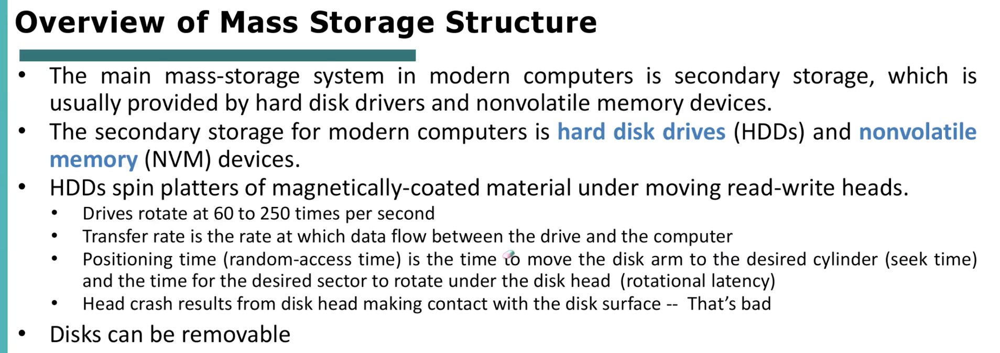

# Mass Storage and I/O

- [Mass Storage and I/O](#mass-storage-and-io)
- [I/O Systems](#io-systems)

> ***Premessa***
*La lezione **Mass Storage and I/O** è abbastanza semplice e di carattere generale, inoltre non stavo bene quando l’ho seguita, dunque non ho preso particolarmente appunti dato che le slides sono molto semplici, autoesplicative e sufficienti per capire i concetti spiegati.*
> 

Tempo necessario per un’operazione di I/O dipende non solo dall’Avarage access time, ma anche dal tempo che impieghiamo a spostare i dati dal disco alla CPU.
Vediamo quindi che sono coinvolti anche altri due tempi: 

- **`amount to transfer / transfer rate`**  → Rapporto tra *quanti dati devo trasferire e velocità di trasferimento*
- **`controller overhead`** → I dispositivi di I/O non possono parlare direttamente con la CPU. Il controller è un un circuito integrato che permette al dispositivo di parlare con il SO. Il *controller overhead* è il tempo che impiega il controller a gestire le operazioni.

Inoltre, poichè il settore che dobbiamo leggere può essere “appena passato”, e quindi impiegare un giro completo prima di essere letto, oppure può essere che il primo settore che sta passando sia proprio quello che dobbiamo leggere, poniamo come ***Avarage latency = latency / 2.***

# I/O Systems

