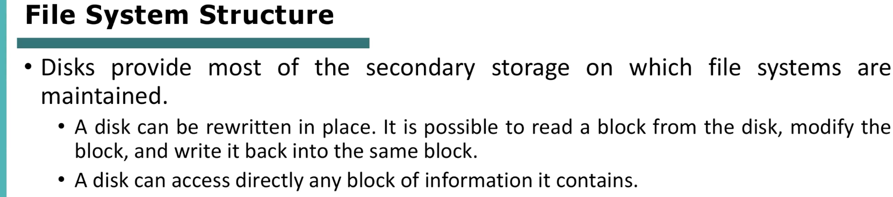

# File-System Implementation

- [File-System Implementation](#file-system-implementation)
  - [Overview](#overview)
  - [Allocation Methods](#allocation-methods)
    - [Contiguous Allocation](#contiguous-allocation)
    - [Linked Allocation](#linked-allocation)
    - [Indexed Allocation](#indexed-allocation)
    - [Unix UFS](#unix-ufs)
  - [Free-space Management](#free-space-management)
    - [Bitmap o bit vector](#bitmap-o-bit-vector)
    - [Linked Free Space List on Disk](#linked-free-space-list-on-disk)
    - [Grouping e Counting](#grouping-e-counting)
  - [Esercizi](#esercizi)
    - [Esercizio 1](#esercizio-1)
    - [Esercizio 2](#esercizio-2)

## Overview

Un filesystem è composto da più “livelli”: i ***Dispositivi*** rientrano nel livello delle tecnologie usate per memorizzare i dati, tutti gli altri livelli invece sono “inclusi” all’interno del Sistema Operativo.

- **I/O Control**
Livello in cui troviamo i **device drivers**, che si occupano di comunicare coi dispositivi.
- **Basic file system**
Livello che consente di impartire i **comandi** ai device drivers (leggi, scrivi etc..).
Questi comandi arrivano al device driver grazie a questo livello di basic file system.
- **File-organization module**
Livello che contiene le informazioni riguardo l’implementazione logica dei dati, quindi ad esempio quanti blocchi logici occupa un file.
- **Logical file system**
Viene usato per gestire i metadati dei dati, in questo livello troviamo un modulo chiamato ***File Control Block***, che contiene, per ciascun file, tutti i metadati.
Ad esempio quando creiamo un nuovo file, questo livello crea un nuovo File Control Block in cui inserisce i metadati del file da creare, e poi scendendo ai livelli inferiori si vanno a fare le operazioni necessarie per creare il file.

**Logical file system**

Il vantaggio di avere un file system a livelli è che alcuni di questi possono essere *condivisi* da file system diversi. Ad esempio potrei avere FAT32 e NTFS su uno stesso sistema operativo, ed entrambi i file system possono sfruttare il medesimo livello di basic file system.
Per lo stesso motivo però, ciò risulta in un overhead maggiore e dunque performance più basse di un sistema unico “ad hoc” — pensiamo ad esempio se un file system volesse fare un’operazione di I/O ma si trova a dover aspettare perchè l’**I/O control** è in uso da un altro file system al momento.

## Allocation Methods

*Come facciamo a decidere quali blocchi allocare per il file da creare?*
Ci sono 3 modi.

### Contiguous Allocation

Svantaggi: possiamo accedere alle informazioni in modo sequenziale o diretto.
Se accediamo in modo sequenziale o diretto, l’allocazione contigua può andare bene.
Però potremmo incappare in **frammentazione esterna!**
Un modo per risolvere sarebbe la **deframmentazione del disco**, che va a compattare gli spazi che si sono creati, ma è un’operazione costosa.

Con l’allocazione contigua abbiamo problemi anche nel caso in cui volessimo *estendere* lo spazio dedicato ad un file.

Per questo motivo esistono un altro tipo di allocazione di blocchi: ***Extent-Based Systems***.
Questi sistemi ci consentono di dedicare inizialmente un certo numero di blocchi, e se necessario poi estenderli tramite altri blocchi, non necessariamente contigui.
Ciò viene fatto memorizzando, nell’ultimo blocco dei primi blocchi allocati per il file, la posizione dei nuovi blocchi allocati.

### Linked Allocation

In ogni blocco è memorizzato l’indirizzo del blocco successivo.
Svantaggi: non possiamo avere accesso diretto ai blocchi — se volessimo ad esempio accedere al quarto blocco, non sapremmo a priori dove si trova. Dovremmo per forza percorrere tutto il percorso fino al quarto blocco.
Vantaggi: non abbiamo frammentazione esterna. Non abbiamo problemi se vogliamo estendere il file (basta trovare un blocco libero e aggiornare i metadati riguardo l’***end*** del file).

Altro svantaggio: in ogni blocco devo riservare dello spazio per memorizzare le informazioni riguardo il blocco successivo — è un po’ uno spreco di spazio.
Una soluzione è il ***clustering***: sappiamo che di solito quando ho un file ho bisogno di più blocchi per esso, quindi ne “raggruppo” ad esempio 4, e questo gruppo lo chiamo *cluster.* In questo modo invece di avere 4 puntatori (uno per ciascun blocco), ne ho uno solo.

Un’altra soluzione a questo problema è l’uso di una ***File Allocation Table***.
Tale tabella memorizza la posizione dei blocchi allocati per il file.

### Indexed Allocation

È il metodo su cui si basano più comunemente i sistemi Unix.

Vantaggi: abbiamo accesso diretto, perchè basta leggere l’index block per trovare la posizione di tutti i blocchi di dati.
Svantaggi: se il file è piccolo, sprechiamo spazio nell’index block, che rimane “vuoto”.

La soluzione più efficiente è usare una combinazione di queste tecniche: ***Unix UFS***.

### Unix UFS

Se ho un file piccolo non usiamo l’Indexed Allocation, ma scriviamo direttamente l’indirizzo dei suoi blocchi nella sezione ***direct blocks***.
Se il file è più grande, usiamo la modalità successiva di accesso: ***single indirect*** — cioè scriviamo in questa sezione l’indirizzo di un singolo blocco, associato al file, che memorizza tutti i puntatori ai blocchi di dati (essenzialmente è un *index block*).
Ovviamente tale blocco ha una dimensione **finita**: se ad esempio avessimo una dimensione di blocco di 4KB, e avessimo indirizzamento a 32bit, vorrebbe dire che potremmo scrivere 4B di informazioni in ogni “riga” del blocco. Dunque 4KB/4B⇒1024 entries, cioè l’index block può puntare a 1024 blocchi dati.
Dunque se dovessimo memorizzare un file che ha bisogno di più di 1024 blocchi dati, potremmo usare la modalità successiva: ***double indirect*** — in cui l’index block punta ora *ad altri index blocks* (quindi potenzialmente 1024 index blocks diversi, con l’esempio precedente), ciascuno dei quali punta a dei blocchi dati (potenzialmente 1024). Dunque in questo caso potremmo memorizzare 1024*1024=1.048.576 blocchi di dati.
C’è poi, ancora, il ***triple indirect*** che introduce un terzo livello di index blocks.

**IMPORTANTE PER ESAME**

## Free-space Management

Abbiamo parlato finora di tecniche per allocare blocchi dati ai files.
Però dobbiamo in qualche modo sapere ***quali*** blocchi disponibili ci sono sul disco.
Solitamente il SO tiene una ***free-space list*** che tiene traccia dei blocchi liberi.

Ci sono 3 modi per capire quali sono i blocchi liberi.

### Bitmap o bit vector

A ogni blocco associamo un bit. Se tale bit è 1 → il blocco è libero.

### Linked Free Space List on Disk

Tutti gli spazi liberi che abbiamo sono *linkati*, dunque memorizziamo solo l’indirizzo del primo blocco disponibile, e poi ciascun blocco punta al prossimo blocco libero.

### Grouping e Counting

---

## Esercizi

### Esercizio 1

Dunque:

- Puntatore = 32bit = 4B
- Block size = 4KB
- FAT size = 150MB

Siccome ogni entry nella FAT rappresenta un blocco, tramite puntatore a 32bit (4B), si ha che: $150MB/4B = 37,5M$ blocchi (cioè *39.321.600* blocchi, perchè 37,5*1024*1024).

Sappiamo che F1 ed F2 hanno lo stesso numero di blocchi di dati, dunque anche anche F2 contiente 37,5M blocchi.

**G)** Dunque:

- a.mp4 size = 317MB
- Block size = 4KB

Ne consegue che: $317MB/4KB = 79,25K$  blocchi occupati da a.mp4 (cioè *81.152* blocchi, perchè 79,24*1024).

**H)** Abbiamo bisogno di tante entries quanti sono i blocchi che occupa a.mp4, dunque 79,25K indici.

**F)** Dunque:

- b.mp4 size = 751MB
- Block size = 4KB

Ne consegue che: $751MB/4KB=187,75K$ blocchi ⇒ *192.256* blocchi di dati (187,75*1024).

10 di questi blocchi li indirizziamo tramite **direct blocks**, dunque 192.256-10 = 192.246.
Poi usiamo 1 **single indirect block** → 192.246 - 1024 = 191.222.
Poi usiamo 1 **double indirect blocks** → 191.222/1024 = 186,74 = 187 blocchi di indice di cui abbiamo ancora bisogno.

Dunque in totale abbiamo: $10 + 1024 + 187 = 1221$ blocchi di indice necessari per indirizzare tutti i nostri blocchi di dati.

>
>💡 **Double indirect blocks**
>
>Facciamo diviso 1024 *(in questo caso abbiamo blocchi da 4KB e puntatori da 4B, dunque 4KB/4B=1024)* perchè nei double indirect blocks abbiamo **un** blocco di indice composto da 1024 entries in totale, ciascuna delle quali è un puntatore ad un altro blocco di indice. Ciascun blocco di indice puntato è composto da 1024 entries, ciascuna delle quali è un puntatore ad un blocco dati, ciascuno di essi composto da 1024 entries (a loro volta, ciascuna entry è 4B, ma di dati questa volta!).
>
>Dunque per capire quanti puntatori usiamo del blocco di indice “a monte”, dobbiamo dividere i blocchi di dati che rimangono, 191.222, per 1024 — ovvero andiamo a vedere quanti blocchi di indice “a valle” andiamo a coprire. 
Il risultato è 187, e quindi abbiamo bisogno di 187 entries (e cioè puntatori) nel blocco di indice a monte.

</aside>

### Esercizio 2

Dunque, calcoliamo innanzitutto quante entries hanno i nostri blocchi:

- Puntatore = 32bit = 4B
- Block size = 2KB

Ne consegue che: $2KB/4B = 512$ entries.

Il file system contiene ***massimo*** (non c’è scritto, ma dovrebbe) 1000 files di dimensione media 15MB. Inoltre, la frammentazione interna **totale** è di 1MB.
Ne consegue che al massimo possiamo memorizzare: $(1000*15MB)+1MB=15001MB$ → ***total files size** — cioè quanto occupano in **totale** tutti questi 1000 files*.

*Di quanti blocchi abbiamo bisogno per memorizzare, in generale, questi dati?*
Dunque avremo: $15001MB/2KB=7500,5K \;\text{blocchi di dati}$ in totale (*7.680.512* blocchi, perchè 7500,5*1024). 

L’esercizio ci chiede però di calcolare **il massimo numero di file** che possiamo memorizzare, arrivando ad usare in un caso l’indice indiretto doppio, e nell’altro l’indice indiretto triplo.
Dunque abbiamo:

$$
\text{number of files} = \frac{\text{total file size}} {\text{single file size}}
$$

Vorremmo massimizzare $\text{number of files}$, e quindi dobbiamo minimizzare $\text{single file size}$, sapendo che in un caso dobbiamo usare indice indiretto doppio, e nell’altro caso indice indiretto triplo.

Esaminiamo prima il caso di **indice indiretto doppio**.
Per sapere il massimo numero di files che possiamo memorizzare sapendo di usare (per tutti i files) l’indice indiretto doppio, dobbiamo calcolare l’occupazione minima di ciascun file — cioè quanti blocchi di dati ogni file occupa sapendo di arrivare ad usare l’indice indiretto doppio.

Noi vorremmo arrivare ad usare l’indice indiretto doppio, dunque sapendo che abbiamo 10 blocchi di indice diretti, e che il single indirect block è un blocco composto da 512 puntatori a blocchi dati, per arrivare ad usare anche l’indice indiretto doppio abbiamo bisogno almeno di:

$$
10 + 512+ 1 = 523 \;\text{blocchi di dato}
$$

In questo modo, il 523esimo blocco lo dovremo per forza indirizzare tramite double indirect blocks.

In conclusione, il massimo numero di files lo otteniamo:

$$
\text{max files number} = \frac{7.680.512}{523} = 14.685
$$

In cui *7.680.512* è la quantità di blocchi di dati effettiva che dobbiamo memorizzare, che andiamo a dividere per *523* che è l’occupazione minima (cioè il minimo numero di blocchi) di ciascun file usando indice indiretto doppio.

Nel caso di **indice indiretto triplo**, dovremmo ripetere il calcolo sapendo che, per arrivare ad usare l’indice indiretto triplo, avremmo bisogno di: $10 + 512 + 512^2 + 1 = 262.667$ blocchi di dato.
In tal caso avremo:

$$
\text{max files number} = \frac{7.680.512}{262.667} = 29
$$

>
>💡 **Nota:**
>
>$\frac{15001MB}{2KB} = \frac{15001K}{2} = \frac{15001 * 1024}{2} = 15001 *512$**
>
